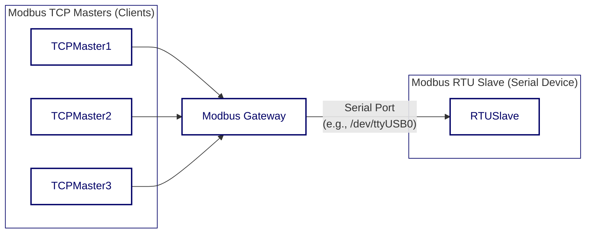

<div align="center">


  <a href="https://github.com/ffutop/modbus-gateway/releases">Download</a>
  ·
  <a href="https://github.com/ffutop/modbus-gateway/issues/new">Report Bug</a>
  ·
  <a href="https://github.com/ffutop/modbus-gateway/issues/new">Request Feature</a>

[English](README.md) |
[中文](README_CN.md)
</div>


A high-performance, configurable Modbus TCP to Modbus RTU gateway written in Go. It acts as a bridge, allowing multiple Modbus TCP masters (clients) to communicate over a network with a single Modbus RTU slave (serial device).

## Architecture

The gateway receives concurrent requests from multiple TCP clients, places them in a queue, and then sends them serially one by one to the RTU device, ensuring that communication on the serial bus does not conflict.



## Features

- **Protocol Conversion**: Seamless conversion between Modbus TCP and Modbus RTU.
- **Concurrent Handling**: Supports multiple TCP clients connecting simultaneously, with requests serialized one by one to the RTU device.
- **Flexible Configuration**: Supports configuration via command-line arguments and YAML configuration files.
- **RS485 Support**: Full support for RS485 communication mode, including `RTS` signal control.
- **Robust Logging System**: Configurable logging levels (debug, info, warn, error) and output targets (console or file).
- **Connection Management**: Automatic handling of serial port connections, disconnections, and idle timeouts.

## Installation

Please make sure you have Go (version 1.21+) installed.

```bash
# Clone the repository
git clone https://github.com/ffutop/modbus-gateway.git
cd modbus-gateway

# Build the binary file
go build -o modbus-gateway
```

After the build process is complete, you will find the `modbus-gateway` executable file in the project root directory.

## Usage

You can start the gateway directly via command-line arguments.

### Command-line Example

Connect to the serial device located at `/dev/ttyUSB0` with a baud rate of `9600` and listen for TCP connections on port `5020` locally:

```bash
./modbus-gateway -p /dev/ttyUSB0 -s 9600 -P 5020 -v debug
```

### Command-line Parameters

Run `./modbus-gateway --help` to view all available parameters:

```text
Usage of ./modbus-gateway:
  -A, --tcp_address string   TCP server address to bind. (default "0.0.0.0")
  -C, --max_conns int        Maximum number of simultaneous TCP connections. (default 32)
  -L, --log_file string      Log file name ('-' for logging to STDOUT only).
  -P, --tcp_port int         TCP server port number. (default 502)
  -R, --rqst_pause int       Pause between requests in milliseconds. (default 100)
  -W, --timeout int          Response wait time in milliseconds. (default 500)
  -c, --config string        Configuration file path.
  -p, --device string        Serial port device name. (default "/tmp/pts1")
  -s, --baud_rate int        Serial port speed. (default 19200)
  -v, --log_level string     Log verbosity level (debug, info, warn, error). (default "info")
```

### Configuration

The gateway's configuration loading follows the following priority order: **Command-line Parameters > Configuration File > Default Values**.

### Configuration File

You can use a YAML file to centrally manage all configurations. Specify the configuration file path using the `-c` or `--config` parameter.

### Default Values

If no configuration file is specified, the gateway will use the default values as defined in the code.

*   `/etc/modbusgw/`
*   `$HOME/.modbusgw/`
*   `./` (current working directory)

#### Example `config.yaml`

Replace this with the following content:


```yaml
# TCP Server Configuration
tcp_address: "0.0.0.0"
tcp_port: 502
max_conns: 32

# Serial/RTU Configuration
device: "/dev/ttyUSB0" # Serial port device name, e.g., "/dev/ttyUSB0" on Linux or "COM3" on Windows
baud_rate: 19200
data_bits: 8
parity: "N" # Parity bit (N: None, E: Even, O: Odd)
stop_bits: 1
timeout: 500ms      # RTU response timeout, supports units: ns, us, ms, s, m, h
rqst_pause: 100ms   # Pause between requests in milliseconds

# Serial/RTU RS485 Configuration (Only configure if needed)
rs485:
  enabled: true
  delay_rts_before_send: 2ms
  delay_rts_after_send: 2ms
  rts_high_during_send: true
  rts_high_after_send: false
  rx_during_tx: false

# Logging Configuration
log_level: "info" # Log verbosity level (debug, info, warn, error)
log_file: ""      # Log file path, '-' for logging to STDOUT only

```

## Development and Testing

Project includes a set of integration tests to verify the core functionalities of the gateway.

### Dependencies

The testing environment relies on `socat` to create virtual serial port pairs. Make sure `socat` is installed on your system.

To install `socat` on a Debian/Ubuntu system:

```bash
sudo apt-get update && sudo apt-get install -y socat
```

### Running Tests

Test scripts will automatically handle the creation of virtual serial port pairs, start a simulated RTU slave, run the gateway, and execute test cases.

```bash
cd test/
go test -v
```

## LICENSE

This project is licensed under the BSD License. See the [LICENSE](LICENSE) file for details.
