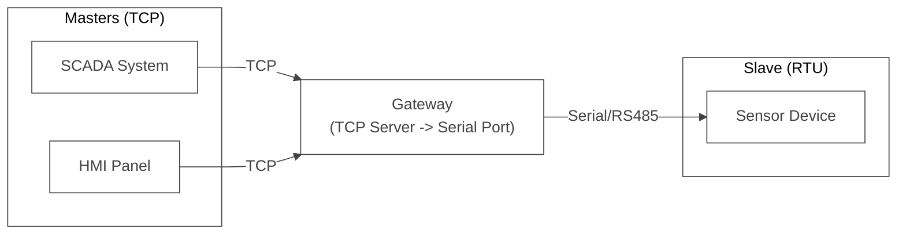
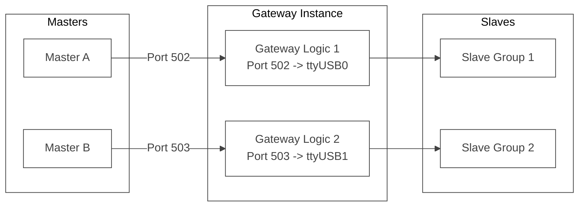
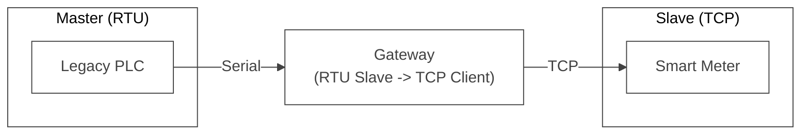
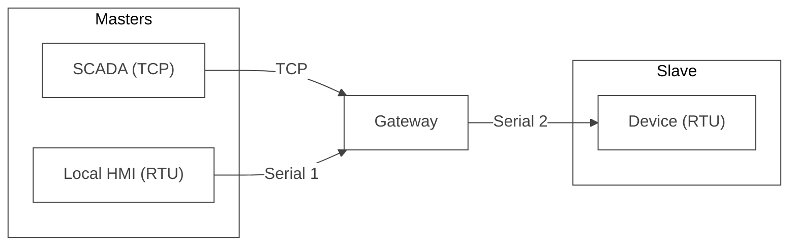
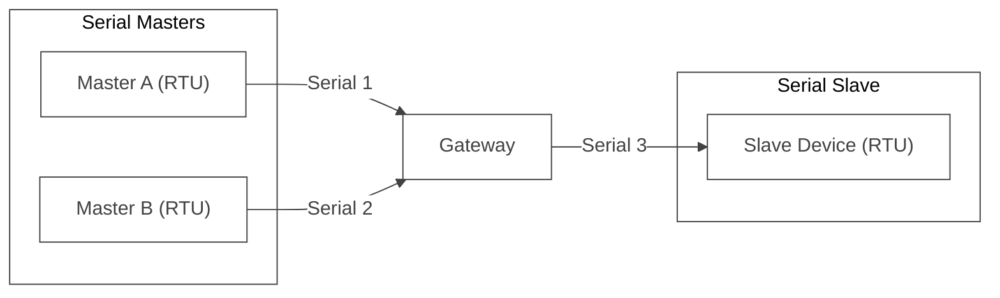

<div align="center">


  <a href="https://github.com/ffutop/modbus-gateway/releases">Download</a>
  ·
  <a href="https://github.com/ffutop/modbus-gateway/issues/new">Report Bug</a>
  ·
  <a href="https://github.com/ffutop/modbus-gateway/issues/new">Request Feature</a>

[English](README.md) |
[中文](README_CN.md)
</div>


# Modbus Gateway

A high-performance, highly flexible Modbus gateway written in Go. It serves as a universal Modbus protocol converter and router, supporting **Multi-Master Multi-Slave** architectures and allowing arbitrary conversion between TCP and RTU (serial) protocols.

## Core Positioning

- **Multi-Master Support**: Allows multiple Masters to access the same Slave simultaneously. The gateway queues and serializes requests to prevent bus conflicts.
- **Multi-Slave Support**: By configuring multiple Gateway rules within a single instance, you can manage multiple slaves connected to different physical ports or network addresses simultaneously.
- **Full Protocol Support**: Both Upstream (Master side) and Downstream (Slave side) can be independently configured as TCP or RTU, enabling any combination of protocol bridging.

## User Scenarios

The flexibility of this gateway makes it suitable for various complex industrial requirements:

### Scenario 1: Typical TCP to RTU (Multi-Master, One Slave)

The most common scenario: Multiple upper-level systems (SCADA, HMI) need to monitor the same traditional Modbus RTU device (e.g., power meter, thermostat) simultaneously. The gateway acts as a TCP Server receiving requests and forwarding them via serial port to the slave.



### Scenario 2: Multi-Channel Isolation (Multi-Gateway)

You can define multiple gateway configurations running in the same process. For example, if you have two RS485 serial ports connected to different device groups, you can open two TCP ports mapped to these serial ports respectively, achieving completely isolated concurrent access.



### Scenario 3: RTU to TCP (Legacy Device Networking)

Using the new bidirectional protocol support, you can use a legacy PLC (which only supports Serial Modbus Master) to control remote Modbus TCP devices. The gateway listens on the serial port (acting as a Slave), converts received commands into TCP requests, and sends them to the remote device.



### Scenario 4: Hybrid Master (TCP + RTU Master -> RTU Slave)

This is one of the most powerful features of this gateway. It allows a traditional local HMI (RTU interface) and a remote SCADA system (TCP interface) to control the same underlying Modbus RTU device simultaneously.



### Scenario 5: Serial Multiplexer

Even without network, you can use it as a "Serial Multiplexer". It allows multiple Serial Masters to share access to a single Serial Slave, solving the problem of insufficient serial ports on legacy devices.



### Scenario 6: TCP Protocol Bridging & Firewall

Design a bridge between two TCP networks. For instance, exposing an internal Modbus TCP device to an external network, or acting as a middleware for protocol sanitization/logging.


## Key Features

- **True Multi-Gateway Architecture**: Run multiple independent conversion logics within a single process.
- **Smart Queuing**: Maintains independent request queues for each downstream slave, ensuring atomicity of RS485 bus communication.
- **Flexible Configuration**: YAML-based configuration system defining clear network topologies.
- **Deep RS485 Support**: Includes RTS signal timing control, adapting to various industrial serial converters.

## Installation

Please make sure you have Go (version 1.21+) installed.

```bash
# Clone the repository
git clone https://github.com/ffutop/modbus-gateway.git
cd modbus-gateway

# Build the binary file
go build -o modbus-gateway
```

After the build process is complete, you will find the `modbus-gateway` executable file in the project root directory.

## Usage
 
The program is driven by a configuration file. You can start multiple gateway instances.
 
### Start
 
Use the `-config` flag to specify the configuration file path:
 
 ```bash
 ./modbus-gateway -config config.yaml
 ```
 
 ## Configuration
 
 ### Configuration Structure
 
 The configuration file supports defining multiple gateways (`gateways`). Each gateway can have multiple upstream masters (`upstreams`) and one downstream slave (`downstream`).
 
 #### Example `config.yaml`
 
 ```yaml
 gateways:
   - name: "gateway-1"
     # Upstream: Who connects to the gateway (Modbus Masters)
     upstreams:
       - type: "tcp"
         tcp:
           address: "0.0.0.0:502"
     # Downstream: Who the gateway connects to (Modbus Slave)
     downstream:
       type: "rtu"
       serial:
         device: "/dev/ttyUSB0"
         baud_rate: 19200
         data_bits: 8
         parity: "N"
         stop_bits: 1
         timeout: "500ms"
 
   # Example: Another gateway instance, TCP to TCP bridge
   - name: "gateway-tcp-bridge"
     upstreams:
       - type: "tcp"
         tcp:
           address: "0.0.0.0:503"
     downstream:
       type: "tcp"
       tcp:
         address: "192.168.1.100:502"
 
 log:
   level: "info" # debug, info, warn, error
   file: ""      # empty for stdout
 ```

## Development and Testing

Project includes a set of integration tests to verify the core functionalities of the gateway.

### Dependencies

The testing environment relies on `socat` to create virtual serial port pairs. Make sure `socat` is installed on your system.

To install `socat` on a Debian/Ubuntu system:

```bash
sudo apt-get update && sudo apt-get install -y socat
```

### Running Tests

Test scripts will automatically handle the creation of virtual serial port pairs, start a simulated RTU slave, run the gateway, and execute test cases.

```bash
cd test/
go test -v
```

## LICENSE

This project is licensed under the BSD License. See the [LICENSE](LICENSE) file for details.
