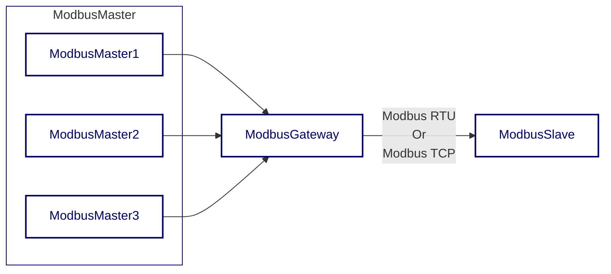

```mermaid
%%{init: { "themeVariables": { "clusterBkg": "#ffffff", "clusterBorder": "#000066" }}}%%
graph LR

subgraph ModbusMaster
    ModbusMaster1
    ModbusMaster2
    ModbusMaster3
end

ModbusGateway

ModbusSlave

ModbusMaster1 --> ModbusGateway 
ModbusMaster2 --> ModbusGateway
ModbusMaster3 --> ModbusGateway

ModbusGateway --"Modbus RTU<br>Or<br>Modbus TCP"--> ModbusSlave

classDef darkStyle fill:#ffffff,stroke:#000066,color:#000066,stroke-width:2px
class ModbusMaster1,ModbusMaster2,ModbusMaster3,ModbusGateway,ModbusSlave darkStyle;
```