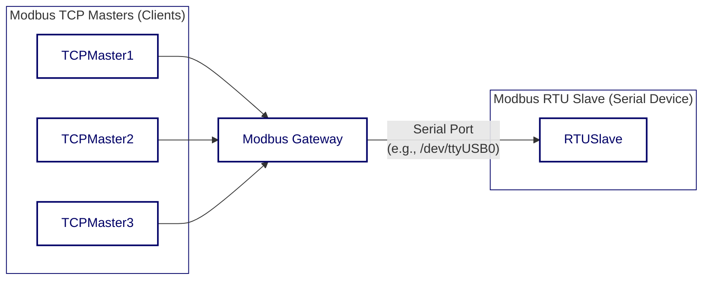

<div align="center">


  <a href="https://github.com/ffutop/modbus-gateway/releases">Download</a>
  ·
  <a href="https://github.com/ffutop/modbus-gateway/issues/new">Report Bug</a>
  ·
  <a href="https://github.com/ffutop/modbus-gateway/issues/new">Request Feature</a>

[English](README.md) |
[中文](README_CN.md)
</div>


A high-performance, configurable Modbus TCP to Modbus RTU gateway written in Go. It acts as a bridge, allowing multiple Modbus TCP masters (clients) to communicate over a network with a single Modbus RTU slave (serial device).

## Architecture

The gateway receives concurrent requests from multiple TCP clients, places them in a queue, and then sends them serially one by one to the RTU device, ensuring that communication on the serial bus does not conflict.



## Features

- **Protocol Conversion**: Seamless conversion between Modbus TCP and Modbus RTU.
- **Concurrent Handling**: Supports multiple TCP clients connecting simultaneously, with requests serialized one by one to the RTU device.
- **Flexible Configuration**: Supports configuration via command-line arguments and YAML configuration files.
- **RS485 Support**: Full support for RS485 communication mode, including `RTS` signal control.
- **Robust Logging System**: Configurable logging levels (debug, info, warn, error) and output targets (console or file).
- **Connection Management**: Automatic handling of serial port connections, disconnections, and idle timeouts.

## Installation

Please make sure you have Go (version 1.21+) installed.

```bash
# Clone the repository
git clone https://github.com/ffutop/modbus-gateway.git
cd modbus-gateway

# Build the binary file
go build -o modbus-gateway
```

After the build process is complete, you will find the `modbus-gateway` executable file in the project root directory.

## Usage
 
The program is driven by a configuration file. You can start multiple gateway instances.
 
### Start
 
Use the `-config` flag to specify the configuration file path:
 
 ```bash
 ./modbus-gateway -config config.yaml
 ```
 
 ## Configuration
 
 ### Configuration Structure
 
 The configuration file supports defining multiple gateways (`gateways`). Each gateway can have multiple upstream masters (`upstreams`) and one downstream slave (`downstream`).
 
 #### Example `config.yaml`
 
 ```yaml
 gateways:
   - name: "gateway-1"
     # Upstream: Who connects to the gateway (Modbus Masters)
     upstreams:
       - type: "tcp"
         tcp:
           address: "0.0.0.0:502"
     # Downstream: Who the gateway connects to (Modbus Slave)
     downstream:
       type: "rtu"
       serial:
         device: "/dev/ttyUSB0"
         baud_rate: 19200
         data_bits: 8
         parity: "N"
         stop_bits: 1
         timeout: "500ms"
 
   # Example: Another gateway instance, TCP to TCP bridge
   - name: "gateway-tcp-bridge"
     upstreams:
       - type: "tcp"
         tcp:
           address: "0.0.0.0:503"
     downstream:
       type: "tcp"
       tcp:
         address: "192.168.1.100:502"
 
 log:
   level: "info" # debug, info, warn, error
   file: ""      # empty for stdout
 ```

## Development and Testing

Project includes a set of integration tests to verify the core functionalities of the gateway.

### Dependencies

The testing environment relies on `socat` to create virtual serial port pairs. Make sure `socat` is installed on your system.

To install `socat` on a Debian/Ubuntu system:

```bash
sudo apt-get update && sudo apt-get install -y socat
```

### Running Tests

Test scripts will automatically handle the creation of virtual serial port pairs, start a simulated RTU slave, run the gateway, and execute test cases.

```bash
cd test/
go test -v
```

## LICENSE

This project is licensed under the BSD License. See the [LICENSE](LICENSE) file for details.
