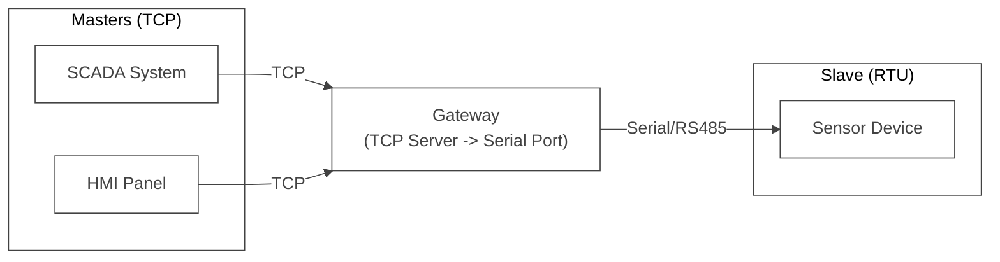
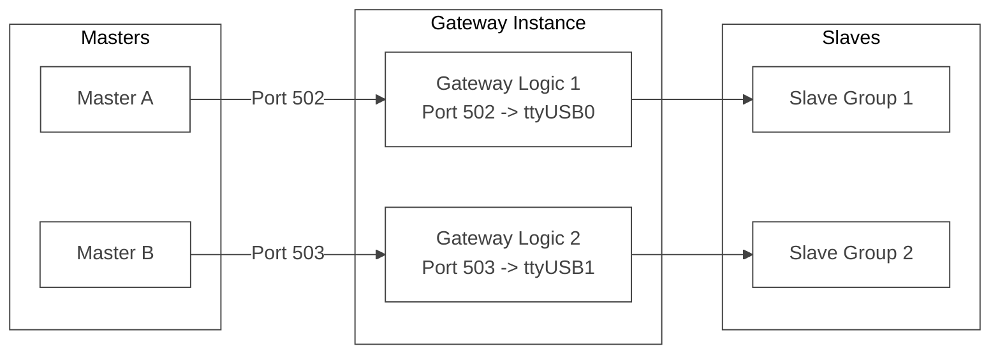
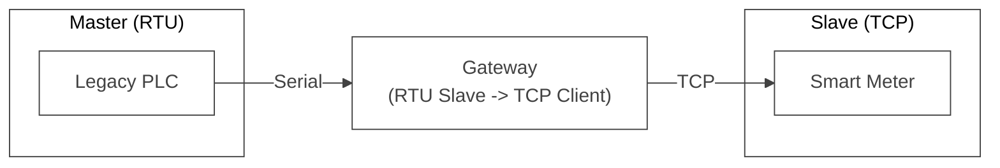
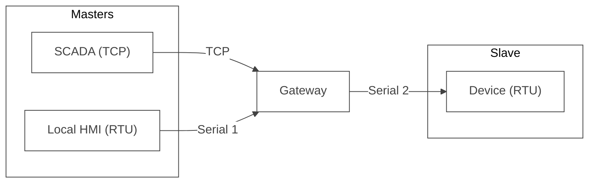
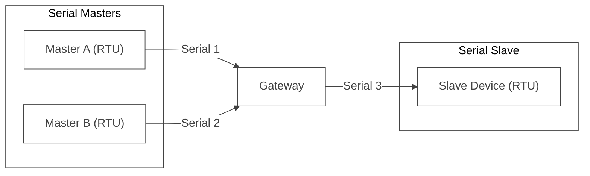
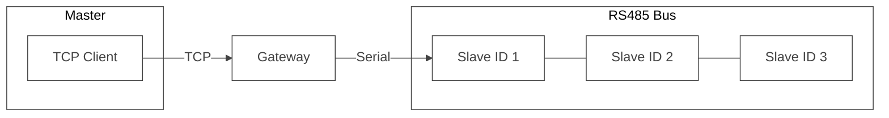
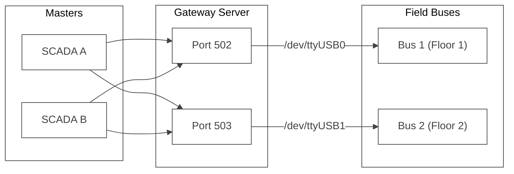

<div align="center">


  <a href="https://github.com/ffutop/modbus-gateway/releases">Download</a>
  ·
  <a href="https://github.com/ffutop/modbus-gateway/issues/new">Report Bug</a>
  ·
  <a href="https://github.com/ffutop/modbus-gateway/issues/new">Request Feature</a>

[English](README.md) |
[中文](README_CN.md)
</div>


# Modbus Gateway

A Modbus protocol converter and router written in Go, supporting multiple masters and slaves, Slave ID routing, local slave simulation, and simulation data injection.

## Core Features

- **Multiple masters and slaves**: Run multiple gateways in one process, each with multiple upstreams and downstreams.
- **Protocol bridging**: Both sides support `tcp`, `rtu`, and `rtu-over-tcp`. TCP uses an MBAP header; RTU-over-TCP carries RTU frames with CRC over TCP. They are not interchangeable.
- **Serialized requests**: A mutex serializes requests through each downstream client object. Slave IDs mapped to that object share the channel; there is no separate queue per ID.
- **Local simulation**: `local` supports FC01–06, FC15, and FC16; `injector` uses standard write requests to update simulated discrete inputs and input registers.
- **Shared data**: Configuration v1 uses `simulation.ref` to share a model across entries and gateways.
- **Flexible configuration**: Define topology in YAML, with memory, file, and mmap storage.
- **Deep RS485 Support**: Includes RTS signal timing control, adapting to various industrial serial converters.

## Contents

- [Quick Start](#quick-start)
- [Configuration and Routing](#configuration-and-routing)
- [Configuration Reference](#configuration-reference)
- [Operations and Troubleshooting](#operations-and-troubleshooting)
- [User Scenarios](#user-scenarios)
- [Implementation Limits](#implementation-limits)
- [Development and Testing](#development-and-testing)
- [License](#license)

## Quick Start

### Recommended: Prebuilt Releases

No Go installation or source build is needed for normal use. Open [GitHub Releases](https://github.com/ffutop/modbus-gateway/releases), select a release, and download its binary archive under **Assets** for your operating system and CPU architecture. Do not select the `Source code` archives.

| Operating system | Platform label | Architecture | Archive / executable |
|---|---|---|---|
| macOS (Intel) | `darwin` | `amd64` | `.tar.gz` / `modbus-gateway` |
| macOS (Apple Silicon) | `darwin` | `arm64` | `.tar.gz` / `modbus-gateway` |
| Linux (x86-64) | `linux` | `amd64` | `.tar.gz` / `modbus-gateway` |
| Linux (64-bit ARM) | `linux` | `arm64` | `.tar.gz` / `modbus-gateway` |
| Windows (x64) | `windows` | `amd64` | `.zip` / `modbus-gateway.exe` |
| Windows (ARM64) | `windows` | `arm64` | `.zip` / `modbus-gateway.exe` |

On macOS/Linux, run `uname -m`: `x86_64` maps to `amd64`, while `arm64`/`aarch64` maps to `arm64`. On Windows, check System type in Settings → System → About.

Extract the archive with your system's archive tool into a writable directory, then open a terminal there. On macOS/Linux, use `chmod +x ./modbus-gateway` if executable permission is missing; on Windows, use PowerShell. Confirm that the program runs:

```bash
# macOS / Linux
./modbus-gateway -h
```

```powershell
# Windows PowerShell
.\modbus-gateway.exe -h
```

Create your own configuration file using the complete example below. Use the README for your selected release: older binaries may not support the current source's v1 configuration or injection features. If a version or field is unsupported, upgrade to a release containing that feature or use the v0 example below. Build from source using this README's instructions when you need unreleased code.

### Alternative: Docker Image

Multi-platform images are published to Docker Hub as `ffutop/modbus-gateway`, covering both `linux/amd64` and `linux/arm64`; Docker pulls the architecture matching your host automatically. Each release also publishes its full version tag (e.g. `0.5.0`) and `major.minor`/`major` tags; check [Docker Hub tags](https://hub.docker.com/r/ffutop/modbus-gateway/tags) for the current list and pin a specific version in production instead of `latest`.

```bash
docker pull ffutop/modbus-gateway:latest
```

The image's default command runs `-config /etc/modbusgw/config.yaml`. Mount your own configuration file (read-only) and a writable data directory for persistence, then publish the ports used by your `tcp.address` values:

```bash
mkdir -p data
docker run -d \
  --name modbus-gateway \
  -p 1502:1502 \
  -v "$(pwd)/config.yaml:/etc/modbusgw/config.yaml:ro" \
  -v "$(pwd)/data:/data" \
  ffutop/modbus-gateway:latest
```

For RTU downstreams, the container also needs access to the host's serial device, e.g. add `--device /dev/ttyUSB0` and confirm the in-container process can read/write it. The image has no built-in TLS or authentication; keep the same network restrictions you would apply to a binary deployment.

### Run Without Hardware

Save this as `quickstart.yaml`. It uses a loopback address, an unprivileged port, and an in-memory model; no serial port or physical device is required:

```yaml
version: 1
simulations:
  - name: demo
    persistence:
      type: memory
gateways:
  - name: local-demo
    upstreams:
      - type: tcp
        tcp:
          address: "127.0.0.1:1502"
    downstreams:
      - type: local
        slave_ids: "1"
        simulation:
          ref: demo
log:
  level: info
  file: "-"
```

```bash
./modbus-gateway -config ./quickstart.yaml
```

```powershell
# Windows PowerShell
.\modbus-gateway.exe -config .\quickstart.yaml
```


After `Modbus TCP server listening` appears, connect a Modbus TCP master to `127.0.0.1:1502`, using Slave ID `1`:

| Step | Request | Expected result |
|---|---|---|
| 1 | FC03, address 0, quantity 1 | A new model returns 0 |
| 2 | FC06, address 0, value 1234 | Successful echo |
| 3 | FC03, address 0, quantity 1 | Returns 1234 |

Addresses here are zero-based protocol addresses. Convert displays such as `40001` according to your master tool. Memory storage resets on restart. Stop with `Ctrl+C`; macOS/Linux also support `SIGTERM`.

`Starting upstream` only indicates a startup attempt, not a successful listener.

### Verify Without a Master Tool

If Python 3 is installed, save this script as `verify.py`. Keep the gateway running and execute `python3 verify.py` in another terminal (`py -3 verify.py` on Windows). It uses only the standard library and writes 1234 to holding register 0 of the Quick Start model before reading it back. Success prints `PASS: holding register[0] = 1234`.

```python
import socket
import struct


def read_exact(sock, count):
    data = b""
    while len(data) < count:
        chunk = sock.recv(count - len(data))
        if not chunk:
            raise RuntimeError("Connection closed before the response completed")
        data += chunk
    return data


def exchange(sock, tid, pdu):
    sock.sendall(struct.pack(">HHHB", tid, 0, len(pdu) + 1, 1) + pdu)
    response_tid, protocol, length, unit = struct.unpack(
        ">HHHB", read_exact(sock, 7))
    if (response_tid, protocol, unit) != (tid, 0, 1) or not 2 <= length <= 254:
        raise RuntimeError("Invalid response header")
    return read_exact(sock, length - 1)


with socket.create_connection(("127.0.0.1", 1502), timeout=3) as sock:
    write = exchange(sock, 1, bytes.fromhex("06 00 00 04 d2"))
    read = exchange(sock, 2, bytes.fromhex("03 00 00 00 01"))
    if write != bytes.fromhex("06 00 00 04 d2") or read != bytes.fromhex("03 02 04 d2"):
        raise RuntimeError(f"Unexpected response: write={write.hex()}, read={read.hex()}")
print("PASS: holding register[0] = 1234")
```

## Configuration and Routing

Pass `-config` explicitly. If omitted, the program searches for a `config` file in `/etc/modbusgw/`, `$HOME/.modbusgw`, and the working directory, in that order. Restart after configuration changes; hot reload is not implemented.

### Configuration Versions

- Use `version: 1` for new configurations. It strictly rejects unknown fields. This is a configuration schema version, not a software release version.
- An omitted `version` or `version: 0` retains the legacy structure, with an independent model per `local` downstream. It must not contain `simulations`, `simulation`, or `injector`.
- In v1, persistence belongs under top-level `simulations[].persistence`, and downstreams use `simulation.ref`. The old downstream `local` block is rejected, not ignored.

#### v0 Example and Migration

This complete configuration provides a local simulation using the legacy schema. Save it as `legacy.yaml` and start with `-config legacy.yaml`. Stop the Quick Start process using the same port first, then verify with the master or Python script above:

```yaml
gateways:
  - name: legacy-local
    upstreams:
      - type: tcp
        tcp: { address: "127.0.0.1:1502" }
    downstreams:
      - type: local
        slave_ids: "1"
        local:
          persistence:
            type: memory
```

To migrate to v1, add `version: 1`, move each model and its persistence settings under top-level `simulations`, assign a unique model name, and replace each downstream's `local` block with `simulation: { ref: model-name }`. If an old downstream exposes multiple IDs, split it into multiple local downstreams referencing the same model to preserve shared data. Back up data first, retain the correct storage path, and ensure each v1 local downstream resolves to a single ID in 1–247.

### TCP to RTU

This is a complete configuration. Adjust the serial device, settings, and Slave IDs to match your equipment. Stop other examples using port 1502 first.

```yaml
version: 1
gateways:
  - name: tcp-to-rtu
    upstreams:
      - type: tcp
        tcp: { address: "127.0.0.1:1502" }
    downstreams:
      - type: rtu
        slave_ids: "1-10"
        serial:
          device: "/dev/ttyUSB0"
          baud_rate: 19200
          data_bits: 8
          parity: N
          stop_bits: 1
          timeout: 500ms
```

### Routing Rules

- `slave_ids` accepts individual IDs, comma-separated lists, and inclusive ranges, such as `"1,3,5-10"`.
- IDs must not repeat within a gateway, including duplicates inside a single string.
- A default route is created only when there is exactly one downstream and its `slave_ids` is empty. An empty ID field among multiple downstreams does not create a fallback; that downstream is unreachable.
- Forwarding preserves the Slave ID, with no ID rewriting or broadcast fan-out. Do not rely on standard broadcast semantics for ID 0.
- In v1, each `local`/`injector` must resolve to exactly one ID in 1–247, such as `"100"`; `"100-100"` also resolves to one ID. To expose multiple IDs, configure multiple downstream entries referencing the same model.

### Shared Simulation and Data Injection

This complete configuration shares `sim-device` between a business port and an injection port. Stop other examples using these ports first:

```yaml
version: 1
simulations:
  - name: sim-device
    persistence:
      type: memory
gateways:
  - name: business-modbus
    upstreams:
      - type: tcp
        tcp: { address: "127.0.0.1:1502" }
    downstreams:
      - type: local
        slave_ids: "100"
        simulation: { ref: sim-device }
  - name: simulation-injection
    upstreams:
      - type: tcp
        tcp: { address: "127.0.0.1:1503" }
    downstreams:
      - type: injector
        slave_ids: "247"
        simulation:
          ref: sim-device
          mappings:
            - source: { table: coils, start_address: 0, count: 256 }
              target: { table: discrete_inputs, start_address: 0 }
            - source: { table: holding_registers, start_address: 0, count: 1024 }
              target: { table: input_registers, start_address: 0 }
```

To verify, send FC06 to `127.0.0.1:1503`, ID `247`, writing 250 to address 0. Read address 0 with FC04 through `127.0.0.1:1502`, ID `100`: it should return 250. FC03 at business address 0 still returns 0.

- Model names must be nonempty and unique, and references must exist. Entries referencing the same model share all four tables; Slave IDs do not isolate data.
- `injector` accepts only FC05/FC06/FC15/FC16, mapping `coils → discrete_inputs` or `holding_registers → input_registers`. It does not modify the source table.
- Each write must fit entirely within one mapping. Unmapped or boundary-crossing writes return `0x02`; unsupported functions, including reads, return `0x01`.
- Source ranges in the same table of an injector must not overlap. Target ranges in the same table of a shared model must not overlap, including across gateways.
- `local` retains standard semantics: discrete inputs/input registers are read-only, while coils/holding registers are writable. It is not a read-only endpoint.
- Separate ports help deploy access controls but do not provide authentication. Restrict injection access with listening addresses and network policies.

### Persistence

Quick Start uses `memory`, which resets on restart. For persistence, run `mkdir -p data`, then replace the model's `persistence` section with this fragment:

```yaml
persistence:
  type: mmap
  path: "./data/sim-device.bin"
```

For `file` and `mmap`, the path must identify a file, not a directory. Relative paths resolve against the process working directory. Do not reuse a file across independent models. The repository's `config.yaml` is a deployment example requiring site-specific changes; create `/data` and grant the runtime user write access before using it.

Failure to open any simulation's storage terminates the entire process. A runtime persistence failure can still leave the in-memory write successful and return a normal response; monitor `simulation persistence degraded` logs. Unknown storage types fall back to memory. The current build does not register a SQLite driver, so `sql` is not directly usable.

`file` writes the entire data region and syncs the file after each write; `mmap` flushes after each write. Neither guarantees zero loss during an unexpected power failure. Both files are 393216 bytes; a different size is resized, truncating larger files. Registers use host byte order, so direct migration across architectures with different endianness is not guaranteed.

Verify recovery by writing a known value, stopping normally, restarting with the same working directory and data path, and reading that address again. For backups, stop the service and copy the configuration, binary version information, and data files. Preserve existing files before restoring, then verify by reading values. If persistence degrades, first read and preserve important new values through Modbus, then resolve disk/permission issues; immediately restarting could lose data that only exists in memory.

## Configuration Reference

Upstream and downstream are from the gateway's perspective: upstreams accept master requests; downstreams connect to devices or process local data. Configure at least one usable upstream and one reachable downstream route.

| Field | Meaning / default behavior |
|---|---|
| `gateways[].name` | Gateway log identifier; use a unique name |
| `upstreams[].type` | `tcp`, `rtu`, or `rtu-over-tcp` |
| `downstreams[].type` | Those three plus `local` and `injector` |
| `downstreams[].name` | Optional downstream identifier; recommended |
| `downstreams[].slave_ids` | Routing expression; forwarding accepts IDs 0–255, subject to device limits |
| `tcp.address` | Local listener for upstreams, target address for downstreams; `host:port` |
| `simulation.ref` | Model referenced by a v1 local/injector downstream |
| `simulation.mappings` | Injector only, at least one; do not declare for local |
| `simulations[].name` | Nonempty, unique model name |
| `simulations[].persistence.type` | `memory`, `file`, or `mmap`; empty/unknown falls back to memory; sql is not directly usable |
| `simulations[].persistence.path` | File/mmap file path; parent must exist and be writable |
| `log.level` | `debug`, `info`, `warn`, `error`; default/unknown uses info; use lowercase |
| `log.file` | Empty or `"-"` uses stdout; otherwise an append-only file; parent directories are not created |
| `pprof.enabled` | Defaults to false |
| `pprof.address` | Defaults to `localhost:6060` when enabled |

`tcp.address: "127.0.0.1:1502"` accepts local connections only. For remote access, use a local network interface address or `0.0.0.0:1502` and configure network access policies. Do not use a wildcard listening address as a downstream destination. V1 checks duplicate listener strings and serial paths, but different strings can still bind conflicting resources; check startup logs.

### Serial Fields

Both RTU upstreams and downstreams use `serial`. Typical device names include `/dev/ttyUSB0` on Linux, the actual full `/dev/cu.usbserial-*` device path on macOS, and `COM3` on Windows. Confirm that the device exists and the runtime user has permission. Settings must match the peer. Validate each platform's drivers and hardware on real equipment.

| `serial` field | Usage |
|---|---|
| `device` | Actual device path or port name |
| `baud_rate` | Such as 9600 or 19200; set explicitly |
| `data_bits` | Such as 8; set explicitly |
| `parity` | Peer-required value such as `N`, `E`, `O`; converted to uppercase |
| `stop_bits` | Such as 1; set explicitly |
| `timeout` | Such as `500ms`, `1s`; omitted or zero becomes 500ms |
| `rqst_pause` | Parsed duration; omitted/zero becomes 100ms; not used by the current RTU transport |
| `rs485` | Boolean RS485 configuration field |
| `delay_rts_before_send` / `delay_rts_after_send` | RTS duration fields, such as `1ms` |
| `rts_high_during_send` / `rts_high_after_send` / `rx_during_tx` | Boolean RTS/transmit/receive configuration fields |

### Local Data and Mapping Fields

Each model has four tables: coils, discrete inputs, holding registers, and input registers. Each has 65536 addresses (0–65535). Registers hold 16-bit values and new models start at zero. Floating-point, unit, and multi-register word-order conversion is not automatic.

| Function code | Local operation | Quantity per request |
|---|---|---|
| FC01 / FC02 | Read coils / discrete inputs | 1–2000 |
| FC03 / FC04 | Read holding / input registers | 1–125 |
| FC05 | Write single coil | 1; protocol value `0xFF00` or `0x0000` |
| FC06 | Write single holding register | 1 |
| FC15 | Write multiple coils | 1–1968 |
| FC16 | Write multiple holding registers | 1–123 |

Each `simulation.mappings[]` entry uses `source.table`, `source.start_address`, `source.count`, `target.table`, and `target.start_address`. Count must be positive. Addresses and count are 16-bit fields; start plus count must not exceed 65536 for either range. The target uses the source count. Target address is `target.start_address + request address - source.start_address`; successful write responses still echo the source address.

## Operations and Troubleshooting

### Lifecycle, Logs, and Timeouts

Start with `-config path-to-config`. Stop and restart after edits. Use `Ctrl+C` or send `SIGTERM` on macOS/Linux; use `Ctrl+C` for a foreground Windows process. Normal shutdown logs `Goodbye.`. Avoid forced termination for routine stops. Before upgrading, stop the service and back up the binary, configuration, and data; replace the binary and verify reads/writes again. Roll back using matching backups.

Failure to open a log file falls back to stdout. There is no built-in log rotation; manage disk capacity separately. Temporarily set `log.level` to `debug` and restart to see hex frames on some transport paths, not necessarily all traffic in both directions. Persistence degradation does not automatically clear, and a successful Modbus write alone does not prove persistence succeeded.

TCP/RTU-over-TCP downstream connection and interaction timeouts are fixed at 10 seconds in code, with no YAML setting. The gateway's 2-second dispatch context is not a reliable end-to-end limit: lock waits, network I/O, and serial behavior still affect latency. Some network I/O failures close the downstream connection; subsequent requests reconnect on demand, without a guarantee of retrying the current request. RTU downstreams close after 60 seconds idle and reopen on demand. Coordinate polling intervals when masters share a downstream.

To enable pprof, add this top-level fragment to the existing YAML and restart, then visit `http://localhost:6060/debug/pprof/`:

```yaml
pprof:
  enabled: true
  address: "localhost:6060"
```

pprof has no built-in authentication; keep it bound to localhost.

### Optional Linux systemd Service

This is a deployment example, not an automatic installation. First create a dedicated `modbusgw` user, place the binary at `/opt/modbus-gateway/modbus-gateway` and configuration at `/opt/modbus-gateway/config.yaml`, and grant configuration read, data directory write, and required serial access permissions. Use `log.file: "-"` and an unprivileged port. Save this as `/etc/systemd/system/modbus-gateway.service`:

```ini
[Unit]
Description=Modbus Gateway
After=network.target

[Service]
Type=simple
User=modbusgw
WorkingDirectory=/opt/modbus-gateway
ExecStart=/opt/modbus-gateway/modbus-gateway -config /opt/modbus-gateway/config.yaml
Restart=on-failure
RestartSec=3

[Install]
WantedBy=multi-user.target
```

```bash
sudo systemctl daemon-reload
sudo systemctl enable --now modbus-gateway
sudo systemctl status modbus-gateway
sudo journalctl -u modbus-gateway -f
# After configuration changes
sudo systemctl restart modbus-gateway
# Stop
sudo systemctl stop modbus-gateway
```

The process may remain running after an upstream fails to start, so an `active` state or restart policy does not replace listener and Modbus read/write checks.

### Common Problems

| Symptom / log | Action |
|---|---|
| Cannot execute / incompatible architecture | Check operating system and amd64/arm64 archive; check executable permissions on macOS/Linux |
| macOS blocks opening | Confirm the binary came from project Releases and follow Privacy & Security prompts; do not disable security checks globally |
| `Failed to load configuration` | Check path, YAML indentation, field spelling, and whether the binary supports the schema |
| `unknown simulation ref` | Match the model name and reference |
| `Duplicate route for slave ID` | Check duplicate IDs and overlapping ranges |
| `listen conflict` / `address already in use` | Change the port or stop your conflicting instance |
| `permission denied` | Check serial/data directory permissions; low ports may require privileges, so start with 1502 |
| `Upstream stopped with error` | Inspect the binding/serial error; process existence alone is insufficient |
| `No route found for slave ID` | Match the master's ID to a route; multiple downstreams have no implicit fallback |
| `Failed to connect downstream` / `Downstream request failed` | Check destination, protocol type, serial settings, wiring, and device response |
| `Failed to open simulation persistence` | Check file path, parent directory, and permissions; do not use a directory as a file |
| `simulation persistence degraded` | Preserve important in-memory values and resolve disk/permission issues before recovery |
| Reads return 0 after injection | Use FC02/FC04 on the business entry's target address; verify simulation.ref; do not read the source table |
| Data lost on restart | Check memory fallback, changed paths/working directory, and previous persistence failures |

For port connectivity, use `nc -zv 127.0.0.1 1502` on macOS/Linux or `Test-NetConnection 127.0.0.1 -Port 1502` in Windows PowerShell. Follow with the Modbus read/write checks above; port connectivity alone is insufficient.

### Exceptions and Actual Responses

| Condition | Current behavior |
|---|---|
| Unsupported local/injector function | `0x01` |
| Local address out of range, unmapped injection, or boundary crossing | `0x02` |
| Some local request length/quantity validation failures | `0x03`, depending on the validation path |
| TCP/RTU-over-TCP handler error, including no route | Usually `0x04` |
| Context deadline error or exact text `modbus: request timed out` | TCP/RTU-over-TCP returns `0x0B`; not every network timeout maps to this code |
| RTU handler error | Logs the error and sends no response; the master typically times out |

## User Scenarios

The flexibility of this gateway makes it suitable for various complex industrial requirements:

### Scenario 1: Typical TCP to RTU (Multi-Master, One Slave)

The most common scenario: Multiple upper-level systems (SCADA, HMI) need to monitor the same traditional Modbus RTU device (e.g., power meter, thermostat) simultaneously. The gateway acts as a TCP Server receiving requests and forwarding them via serial port to the slave.


```mermaid
---
config:
  theme: base
  themeVariables:
    primaryColor: '#ffffff'
    primaryBorderColor: '#424242'
    primaryTextColor: '#424242'
    secondaryColor: '#ffffff'
    secondaryBorderColor: '#424242'
    secondaryTextColor: '#424242'
    lineColor: '#424242'
    edgeLabelBackground: '#ffffff'
    clusterBkg: '#ffffff'
    clusterBorder: '#424242'
    tertiaryColor: '#ffffff'
---
graph LR
    subgraph "Masters (TCP)"
        M1["SCADA System"]
        M2["HMI Panel"]
    end

    G["Gateway<br>(TCP Server -> Serial Port)"]

    subgraph "Slave (RTU)"
        S1["Sensor Device"]
    end

    M1 -->|TCP| G
    M2 -->|TCP| G
    G -->|Serial/RS485| S1
```

### Scenario 2: Multi-Channel Isolation (Multi-Gateway)

You can define multiple gateway configurations running in the same process. For example, if you have two RS485 serial ports connected to different device groups, you can open two TCP ports mapped to these serial ports respectively, enabling concurrent access through separate physical channels. Gateways that reference the same simulation still share its data.


```mermaid
---
config:
  theme: base
  themeVariables:
    primaryColor: '#ffffff'
    primaryBorderColor: '#424242'
    primaryTextColor: '#424242'
    secondaryColor: '#ffffff'
    secondaryBorderColor: '#424242'
    secondaryTextColor: '#424242'
    lineColor: '#424242'
    edgeLabelBackground: '#ffffff'
    clusterBkg: '#ffffff'
    clusterBorder: '#424242'
    tertiaryColor: '#ffffff'
---
graph LR
    subgraph "Masters"
        M1["Master A"]
        M2["Master B"]
    end

    subgraph "Gateway Instance"
        G1["Gateway Logic 1<br>Port 502 -> ttyUSB0"]
        G2["Gateway Logic 2<br>Port 503 -> ttyUSB1"]
    end

    subgraph "Slaves"
        S1["Slave Group 1"]
        S2["Slave Group 2"]
    end

    M1 -->|Port 502| G1 --> S1
    M2 -->|Port 503| G2 --> S2
```

### Scenario 3: RTU to TCP (Legacy Device Networking)

Using bidirectional protocol support, you can use a legacy PLC (which only supports Serial Modbus Master) to control remote Modbus TCP devices. The gateway listens on the serial port (acting as a Slave), converts received commands into TCP requests, and sends them to the remote device.


```mermaid
---
config:
  theme: base
  themeVariables:
    primaryColor: '#ffffff'
    primaryBorderColor: '#424242'
    primaryTextColor: '#424242'
    secondaryColor: '#ffffff'
    secondaryBorderColor: '#424242'
    secondaryTextColor: '#424242'
    lineColor: '#424242'
    edgeLabelBackground: '#ffffff'
    clusterBkg: '#ffffff'
    clusterBorder: '#424242'
    tertiaryColor: '#ffffff'
---
graph LR
    subgraph "Master (RTU)"
        PLC["Legacy PLC"]
    end

    G["Gateway<br>(RTU Slave -> TCP Client)"]

    subgraph "Slave (TCP)"
        Remote["Smart Meter"]
    end

    PLC -->|Serial| G -->|TCP| Remote
```

### Scenario 4: Hybrid Master (TCP + RTU Master -> RTU Slave)

This is one of the most powerful features of this gateway. It allows a traditional local HMI (RTU interface) and a remote SCADA system (TCP interface) to control the same underlying Modbus RTU device simultaneously.


```mermaid
---
config:
  theme: base
  themeVariables:
    primaryColor: '#ffffff'
    primaryBorderColor: '#424242'
    primaryTextColor: '#424242'
    secondaryColor: '#ffffff'
    secondaryBorderColor: '#424242'
    secondaryTextColor: '#424242'
    lineColor: '#424242'
    edgeLabelBackground: '#ffffff'
    clusterBkg: '#ffffff'
    clusterBorder: '#424242'
    tertiaryColor: '#ffffff'
---
graph LR
    subgraph "Masters"
        M1["SCADA (TCP)"]
        M2["Local HMI (RTU)"]
    end

    G["Gateway"]

    subgraph "Slave"
        S1["Device (RTU)"]
    end

    M1 -->|TCP| G
    M2 -->|Serial 1| G
    G -->|Serial 2| S1
```

### Scenario 5: Serial Multiplexer

Even without network, you can use it as a "Serial Multiplexer". It allows multiple Serial Masters to share access to a single Serial Slave, solving the problem of insufficient serial ports on legacy devices.


```mermaid
---
config:
  theme: base
  themeVariables:
    primaryColor: '#ffffff'
    primaryBorderColor: '#424242'
    primaryTextColor: '#424242'
    secondaryColor: '#ffffff'
    secondaryBorderColor: '#424242'
    secondaryTextColor: '#424242'
    lineColor: '#424242'
    edgeLabelBackground: '#ffffff'
    clusterBkg: '#ffffff'
    clusterBorder: '#424242'
    tertiaryColor: '#ffffff'
---
graph LR
    subgraph "Serial Masters"
        M1["Master A (RTU)"]
        M2["Master B (RTU)"]
    end

    G["Gateway"]

    subgraph "Serial Slave"
        S1["Slave Device (RTU)"]
    end

    M1 -->|Serial 1| G
    M2 -->|Serial 2| G
    G -->|Serial 3| S1
```

### Scenario 6: TCP Protocol Bridging

Forward requests between masters and Modbus TCP devices within controlled networks. The gateway does not implement a firewall, authentication, or configurable protocol filtering; restrict access through network policies.


```mermaid
---
config:
  theme: base
  themeVariables:
    primaryColor: '#ffffff'
    primaryBorderColor: '#424242'
    primaryTextColor: '#424242'
    secondaryColor: '#ffffff'
    secondaryBorderColor: '#424242'
    secondaryTextColor: '#424242'
    lineColor: '#424242'
    edgeLabelBackground: '#ffffff'
    clusterBkg: '#ffffff'
    clusterBorder: '#424242'
    tertiaryColor: '#ffffff'
---
graph LR
    M[Remote Master] -->|TCP Network A| G[Gateway] -->|TCP Network B| S[Local Slave]
```

### Scenario 7: One Master Multi-Slave (RS485 Bus Daisychain)

This is the standard topology for Modbus RTU. The gateway supports transparent transmission, allowing you to mount multiple slave devices (e.g., ID 1, ID 2, ID 3...) on a single serial port (downstream). The TCP Master only needs to specify the target Slave ID, and the gateway will send the request to the bus, where the corresponding device will respond automatically.


```mermaid
---
config:
  theme: base
  themeVariables:
    primaryColor: '#ffffff'
    primaryBorderColor: '#424242'
    primaryTextColor: '#424242'
    secondaryColor: '#ffffff'
    secondaryBorderColor: '#424242'
    secondaryTextColor: '#424242'
    lineColor: '#424242'
    edgeLabelBackground: '#ffffff'
    clusterBkg: '#ffffff'
    clusterBorder: '#424242'
    tertiaryColor: '#ffffff'
---
graph LR
    subgraph "Master"
        M["TCP Client"]
    end

    G["Gateway"]

    subgraph "RS485 Bus"
        S1["Slave ID 1"]
        S2["Slave ID 2"]
        S3["Slave ID 3"]
    end

    M -->|TCP| G -->|Serial| S1
    S1 --- S2 --- S3
```

### Scenario 8: Centralized Bus Management (Multi-Master Multi-Slave)

In large-scale systems, you might have multiple RS485 networks (e.g., Floor 1 Bus, Floor 2 Bus). You can configure multiple forwarding rules on a single gateway server, mapping different TCP ports to different physical serial ports. All upper-level systems (Masters) can access the corresponding bus networks by connecting to different ports, achieving centralized management.


```mermaid
---
config:
  theme: base
  themeVariables:
    primaryColor: '#ffffff'
    primaryBorderColor: '#424242'
    primaryTextColor: '#424242'
    secondaryColor: '#ffffff'
    secondaryBorderColor: '#424242'
    secondaryTextColor: '#424242'
    lineColor: '#424242'
    edgeLabelBackground: '#ffffff'
    clusterBkg: '#ffffff'
    clusterBorder: '#424242'
    tertiaryColor: '#ffffff'
---
graph LR
    subgraph "Masters"
        M1["SCADA A"]
        M2["SCADA B"]
    end

    subgraph "Gateway Server"
        P1["Port 502"]
        P2["Port 503"]
    end

    subgraph "Field Buses"
        B1["Bus 1 (Floor 1)"]
        B2["Bus 2 (Floor 2)"]
    end

    M1 --> P1
    M1 --> P2
    M2 --> P1
    M2 --> P2
    P1 -->|/dev/ttyUSB0| B1
    P2 -->|/dev/ttyUSB1| B2
```

## Implementation Limits

- The gateway does not provide TLS, authentication, firewall policies, or configuration hot reload.
- Supporting a transport does not imply support for every Modbus function code; framing and the target device also impose limits.
- Gateways may share simulation models. Independent physical channels require separate port/serial resources.
- HTML pages under `docs/` are not connected to the running service. There is no online configuration or live monitoring management API.
- The main program does not integrate MQTT or Kafka. Optional pprof is a Go profiling service, not a management interface.
- Repository configuration and examples describe the current source; historical release packages may not include these capabilities.

## Development and Testing

### Build from Source (Optional)

Prefer Releases when you only need to run the gateway. Build when modifying code or using unreleased features. The root module requires Go 1.21+ and access to module dependencies on the first build:

```bash
git clone https://github.com/ffutop/modbus-gateway.git
cd modbus-gateway
go build -o modbus-gateway .
```

On Windows, run the same clone and directory commands in PowerShell, then build with `go build -o modbus-gateway.exe .`. Continue with Quick Start after building.

### Root Module Tests

Run from the repository root with the same Go requirement as the build:

```bash
go test ./...
```

### Separate Integration Tests

`test/` is a separate Go module requiring **Go 1.24.3+**. It is not included in root-level `go test ./...`. It requires `socat`, an executable `test/socat_runner.sh`, an environment permitting virtual serial ports and test listeners, and a prebuilt `modbus-gateway` binary in the repository root.

On Debian/Ubuntu, install the dependency with:

```bash
sudo apt-get update
sudo apt-get install -y socat
```

From the repository root:

```bash
go build -o modbus-gateway .
cd test
go test -v ./...
```

Tests start virtual serial ports, simulated slaves, and gateway processes. Virtual serial tests do not replace validation against real RS485 hardware.

## License

This project is licensed under **BSD-3-Clause**. See [LICENSE](LICENSE).
