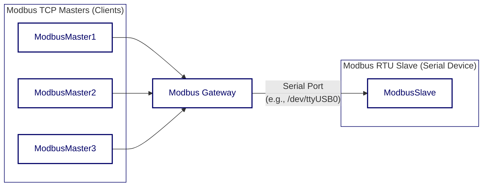

<div align="center">


  <a href="https://github.com/ffutop/modbus-gateway/releases">下载</a>
  ·
  <a href="https://github.com/ffutop/modbus-gateway/issues/new">提交问题</a>
  ·
  <a href="https://github.com/ffutop/modbus-gateway/issues/new">请求功能</a>

[English](README.md) |
[中文](README_CN.md)
</div>

# Modbus Gateway

一个使用 Go 语言编写的高性能、可配置的 Modbus TCP 到 Modbus RTU 网关。它充当一个桥梁，允许多个 Modbus TCP 主站（客户端）通过网络与单个 Modbus RTU 从站（串行设备）进行通信。

## 架构

网关接收来自多个 TCP 客户端的并发请求，将它们放入一个队列中，然后以串行方式逐一发送到 RTU 设备，确保了串行总线上的通信不会发生冲突。



## 主要特性

*   **协议转换**: 实现 Modbus TCP 到 Modbus RTU 的无缝转换。
*   **并发处理**: 支持多个 TCP 客户端同时连接，通过内部队列将并发请求串行化。
*   **灵活配置**: 支持通过命令行参数和 YAML 配置文件进行灵活配置。
*   **RS485 支持**: 内置对 RS485 通信模式的完整支持，包括 `RTS` 信号控制。
*   **健壮的日志系统**: 可配置的日志级别（debug, info, warn, error）和日志输出目标（文件或控制台）。
*   **连接管理**: 自动处理串口的连接、断开和空闲超时。

## 安装

确保您已安装 Go (版本 1.21+)。

```bash
# 克隆仓库
git clone https://github.com/ffutop/modbus-gateway.git
cd modbus-gateway

# 构建二进制文件
go build
```

执行完毕后，您将在项目根目录下找到名为 `modbus-gateway` 的可执行文件。

## 使用方法
 
本程序通过配置文件驱动。您可以启动多个网关实例。
 
### 启动
 
使用 `-config` 参数指定配置文件路径：
 
 ```bash
 ./modbus-gateway -config config.yaml
 ```
 
 ## 配置
 
### 配置文件结构
 
配置文件支持定义多个网关 (`gateways`)。每个网关可以有多个上游主站 (`upstreams`) 和一个下游从站 (`downstream`)。
 
 #### 示例 `config.yaml`
 
 ```yaml
 gateways:
   - name: "gateway-1"
     # 上游: 谁连接到网关 (Modbus Masters)
     upstreams:
       - type: "tcp"
         tcp:
           address: "0.0.0.0:502"
     # 下游: 网关连接到谁 (Modbus Slave)
     downstream:
       type: "rtu"
       serial:
         device: "/dev/ttyUSB0"
         baud_rate: 19200
         data_bits: 8
         parity: "N"
         stop_bits: 1
         timeout: "500ms"
 
   # 示例: 另一个网关实例，TCP 转 TCP
   - name: "gateway-tcp-bridge"
     upstreams:
       - type: "tcp"
         tcp:
           address: "0.0.0.0:503"
     downstream:
       type: "tcp"
       tcp:
         address: "192.168.1.100:502"
 
 log:
   level: "info" # debug, info, warn, error
   file: ""      # 为空输出到控制台
 ```

## 开发与测试

本项目包含一套集成测试，用于验证网关的核心功能。

### 依赖

测试环境依赖 `socat` 来创建虚拟串口对。请确保您的系统已安装 `socat`。

在基于 Debian/Ubuntu 的系统上安装：
```bash
sudo apt-get update && sudo apt-get install -y socat
```

### 运行测试

测试脚本会自动处理虚拟串口的创建、启动模拟的 RTU 从站、运行网关以及执行测试用例。

```bash
cd test/
go test -v
```

## 许可证

本项目基于 BSD 许可证。详情请参阅[LICENSE 文件](LICENSE)。
