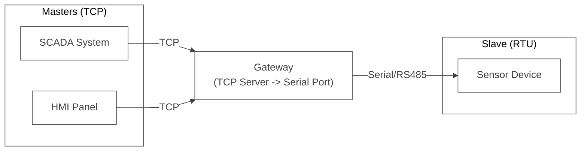
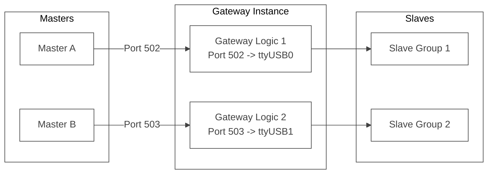
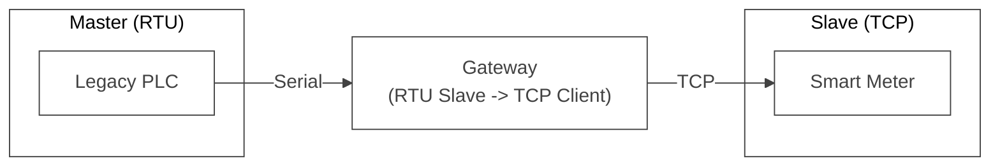
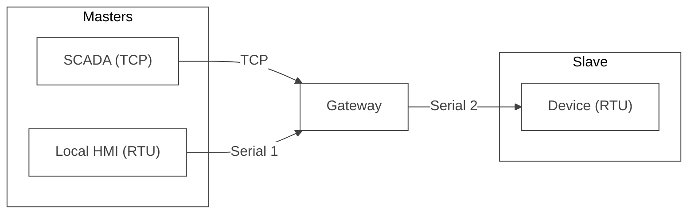
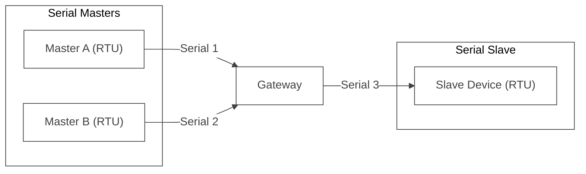
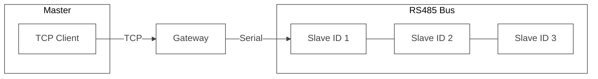
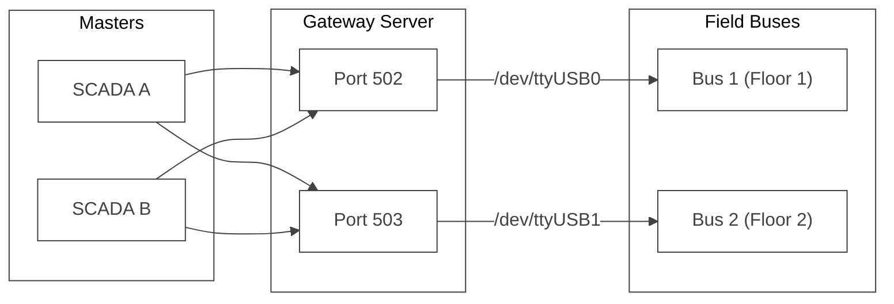

<div align="center">


  <a href="https://github.com/ffutop/modbus-gateway/releases">下载</a>
  ·
  <a href="https://github.com/ffutop/modbus-gateway/issues/new">提交问题</a>
  ·
  <a href="https://github.com/ffutop/modbus-gateway/issues/new">请求功能</a>

[English](README.md) |
[中文](README_CN.md)
</div>

# Modbus Gateway

一个使用 Go 语言编写的高性能、高灵活性的 Modbus 网关。它是一个通用的 Modbus 协议转换器与路由器，支持 **多主多从** 架构，并允许 TCP 与 RTU（串行）协议之间的任意互转。

## 核心定位

- **多主支持 (Multi-Master)**: 允许多个主站（Master）同时访问同一个从站（Slave），网关会自动对请求进行排队和串行化，防止总线冲突。
- **多从支持 (Multi-Slave)**: 通过在一个实例中配置多个网关规则（Gateways），可以同时管理连接在不同物理端口或网络地址上的多个从站。
- **全协议支持**: 上游（Master端）和下游（Slave端）均可独立配置为 TCP 或 RTU 模式，实现任意组合的协议桥接。

## 用户场景

本网关的灵活性使其适用于多种复杂的工业现场需求：

### 场景 1: 典型 TCP 转 RTU (多主一从)

最常见的场景：多个上位机（SCADA, HMI）需要同时监控同一台传统的 Modbus RTU 设备（如电表、温控器）。网关作为 TCP 服务器接收请求，并通过串口转发给从站。



### 场景 2: 多通道隔离 (多主多从)

您可以定义多个网关配置运行在同一个进程中。例如，您有两个 RS485 串口，分别连接了不同的设备群。您可以开启两个 TCP 端口，分别映射到这两个串口，实现完全隔离的并发访问。



### 场景 3: RTU 转 TCP (旧设备联网)

利用新的双向协议支持，您可以用传统的 PLC（仅支持串口 Modbus Master）去控制远程的 Modbus TCP 设备。网关监听串口（作为从站），将收到的指令转换为 TCP 请求发送给远程设备。



### 场景 4: 混合协议主站 (TCP + RTU Master -> RTU Slave)

这是本网关最强大的功能之一。它允许传统的本地 HMI（RTU 接口）和远程的 SCADA 系统（TCP 接口）同时控制同一个底层的 Modbus RTU 设备。



### 场景 5: 纯串口复用 (Serial Multiplexer)

即使没有网络，您也可以将其作为“串口复用器”使用。允许多个串口主站（Master）共享访问一个串口从站（Slave），解决传统设备串口数量不足的问题。



### 场景 6: TCP 协议桥接与防火墙

在两个 TCP 网络之间建立桥梁。例如，将内网的 Modbus TCP 设备暴露给外网，或者作为协议清洗/日志记录的中间件。


### 场景 7: 一主多从 (RS485 总线级联)

这是 Modbus RTU 的标准拓扑。网关支持透明传输，您可以在单个串口（下游）上挂载多台从站设备（如 ID 1, ID 2, ID 3...）。TCP 主站只需指定目标 Slave ID，网关即可将请求发送至总线，相应的设备会自动响应。



### 场景 8: 集中式多总线管理 (多主多从)

在大型系统中，您可能拥有多个 RS485 网络（例如：楼层 1 总线、楼层 2 总线）。您可以在同一台网关服务器上配置多个转发规则，将不同的 TCP 端口映射到不同的物理串口。所有上位机（Masters）可以通过连接不同的端口来访问对应的总线网络，实现集中化管理。



## 主要特性

- **真正的多网关架构**: 单进程内运行多个独立的转换逻辑。
- **智能队列**: 为每个下游从站维护独立的请求队列，确保 RS485 总线通讯的原子性。
- **配置热加载**: (TODO) 支持动态更新配置。
- **灵活配置**: 基于 YAML 的配置体系，清晰定义网络拓扑。
- **RS485 深度支持**: 包含 RTS 信号时序控制，适应各种工业串口转接器。

## 安装

确保您已安装 Go (版本 1.21+)。

```bash
# 克隆仓库
git clone https://github.com/ffutop/modbus-gateway.git
cd modbus-gateway

# 构建二进制文件
go build
```

执行完毕后，您将在项目根目录下找到名为 `modbus-gateway` 的可执行文件。

## 使用方法
 
本程序通过配置文件驱动。您可以启动多个网关实例。
 
### 启动
 
使用 `-config` 参数指定配置文件路径：
 
 ```bash
 ./modbus-gateway -config config.yaml
 ```
 
 ## 配置
 
### 配置文件结构
 
配置文件支持定义多个网关 (`gateways`)。每个网关可以有多个上游主站 (`upstreams`) 和一个下游从站 (`downstream`)。
 
 #### 示例 `config.yaml`
 
 ```yaml
 gateways:
   - name: "gateway-1"
     # 上游: 谁连接到网关 (Modbus Masters)
     upstreams:
       - type: "tcp"
         tcp:
           address: "0.0.0.0:502"
     # 下游: 网关连接到谁 (Modbus Slave)
     downstream:
       type: "rtu"
       serial:
         device: "/dev/ttyUSB0"
         baud_rate: 19200
         data_bits: 8
         parity: "N"
         stop_bits: 1
         timeout: "500ms"
 
   # 示例: 另一个网关实例，TCP 转 TCP
   - name: "gateway-tcp-bridge"
     upstreams:
       - type: "tcp"
         tcp:
           address: "0.0.0.0:503"
     downstream:
       type: "tcp"
       tcp:
         address: "192.168.1.100:502"
 
 log:
   level: "info" # debug, info, warn, error
   file: ""      # 为空输出到控制台
 ```

## 开发与测试

本项目包含一套集成测试，用于验证网关的核心功能。

### 依赖

测试环境依赖 `socat` 来创建虚拟串口对。请确保您的系统已安装 `socat`。

在基于 Debian/Ubuntu 的系统上安装：
```bash
sudo apt-get update && sudo apt-get install -y socat
```

### 运行测试

测试脚本会自动处理虚拟串口的创建、启动模拟的 RTU 从站、运行网关以及执行测试用例。

```bash
cd test/
go test -v
```

## 许可证

本项目基于 BSD 许可证。详情请参阅[LICENSE 文件](LICENSE)。
