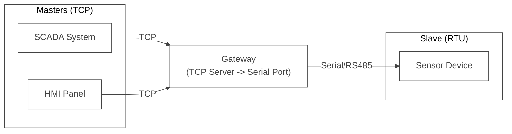
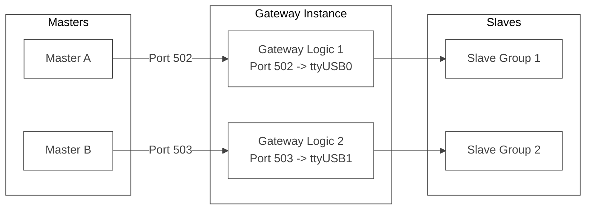
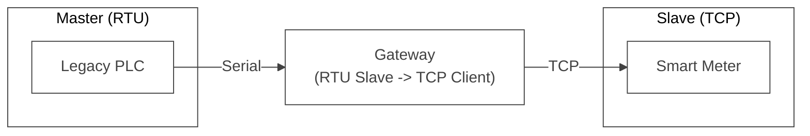
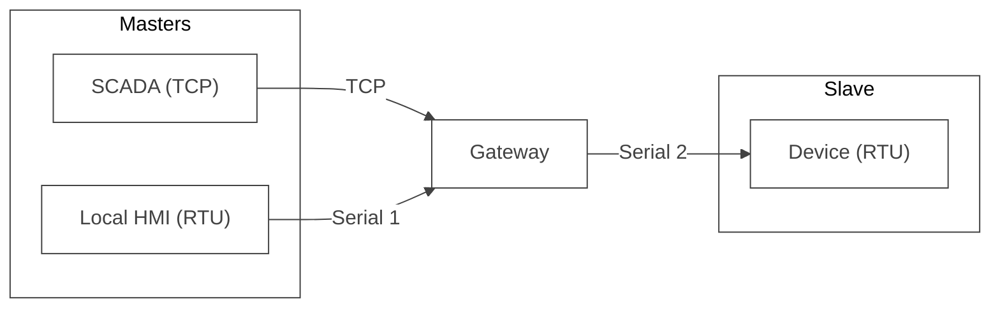
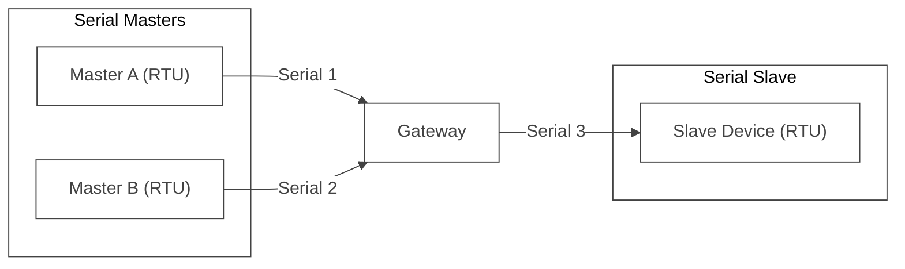
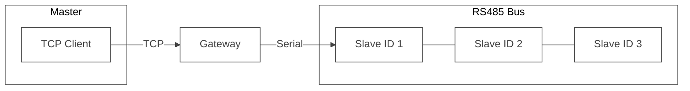
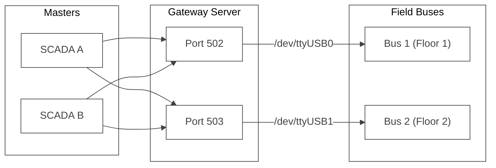

<div align="center">


  <a href="https://github.com/ffutop/modbus-gateway/releases">下载</a>
  ·
  <a href="https://github.com/ffutop/modbus-gateway/issues/new">提交问题</a>
  ·
  <a href="https://github.com/ffutop/modbus-gateway/issues/new">请求功能</a>

[English](README.md) |
[中文](README_CN.md)
</div>

# Modbus Gateway

一个使用 Go 编写的 Modbus 协议转换器与路由器，支持多主多从、按 Slave ID 路由、本地从站仿真和模拟数据注入。

## 核心能力

- **多主多从**：单进程可运行多个网关，每个网关支持多个上游和下游。
- **协议桥接**：上下游均支持 `tcp`、`rtu`、`rtu-over-tcp`。TCP 使用 MBAP 头；RTU-over-TCP 在 TCP 连接中传输带 CRC 的 RTU 帧，两者不能混用。
- **请求串行化**：同一个下游客户端对象通过互斥锁串行执行请求；映射到它的多个 Slave ID 共用该通道，不是每个 ID 一个独立队列。
- **本地仿真**：`local` 支持 FC01–06、FC15、FC16；`injector` 通过标准写请求更新仿真的离散输入和输入寄存器。
- **共享数据**：配置 v1 可通过 `simulation.ref` 在不同入口、不同网关间共享模型。
- **灵活配置**：使用 YAML 定义拓扑，支持内存、文件和 mmap 存储。
- **RS485 深度支持**: 包含 RTS 信号时序控制，适应各种工业串口转接器。

## 目录

- [快速开始](#快速开始)
- [配置与路由](#配置与路由)
- [配置字段参考](#配置字段参考)
- [运行维护与故障排查](#运行维护与故障排查)
- [用户场景](#用户场景)
- [实现边界](#实现边界)
- [开发与测试](#开发与测试)
- [许可证](#许可证)

## 快速开始

### 推荐：下载预构建 Releases

普通使用无需安装 Go 或编译源码。打开 [GitHub Releases](https://github.com/ffutop/modbus-gateway/releases)，选择所需版本，在 **Assets** 中下载适合操作系统与 CPU 架构的二进制压缩包，不要选择 `Source code` 源码归档。

| 操作系统 | 平台标识 | 架构选择 | 压缩格式 / 可执行文件 |
|---|---|---|---|
| macOS（Intel） | `darwin` | `amd64` | `.tar.gz` / `modbus-gateway` |
| macOS（Apple Silicon） | `darwin` | `arm64` | `.tar.gz` / `modbus-gateway` |
| Linux（x86-64） | `linux` | `amd64` | `.tar.gz` / `modbus-gateway` |
| Linux（64 位 ARM） | `linux` | `arm64` | `.tar.gz` / `modbus-gateway` |
| Windows（x64） | `windows` | `amd64` | `.zip` / `modbus-gateway.exe` |
| Windows（ARM64） | `windows` | `arm64` | `.zip` / `modbus-gateway.exe` |

macOS/Linux 可通过 `uname -m` 查看架构：`x86_64` 对应 `amd64`，`arm64`/`aarch64` 对应 `arm64`。Windows 在“设置 → 系统 → 关于”中查看系统类型。

下载后用系统解压工具解压到可写目录，在终端进入解压目录。macOS/Linux 若提示不可执行，可执行 `chmod +x ./modbus-gateway`；Windows 使用 PowerShell。先验证程序能运行：

```bash
# macOS / Linux
./modbus-gateway -h
```

```powershell
# Windows PowerShell
.\modbus-gateway.exe -h
```

配置文件需要自行创建，下面提供可直接保存的完整示例。请使用所选发布版本对应的 README；旧版二进制可能不支持当前源码的配置 v1/注入功能。如果收到不支持版本或字段的错误，应升级到包含该功能的发布版本，或使用下文的 v0 示例。需要尚未发布的代码时，再按本文“源码构建”操作。

### 另一种方式：Docker 镜像

仓库同时向 Docker Hub 发布多架构镜像 `ffutop/modbus-gateway`，覆盖 `linux/amd64` 与 `linux/arm64` 两种平台，Docker 会自动拉取与宿主机匹配的架构。每个发布版本还会附带完整版本号标签（如 `0.5.0`）及 `major.minor`/`major` 标签，可在 [Docker Hub tags](https://hub.docker.com/r/ffutop/modbus-gateway/tags) 查看当前可用列表；生产环境建议固定具体版本号，而非使用 `latest`。

```bash
docker pull ffutop/modbus-gateway:latest
```

镜像默认执行 `-config /etc/modbusgw/config.yaml`。请挂载自己的配置文件（只读）与可写的数据目录用于持久化，并根据配置中的 `tcp.address` 发布对应端口：

```bash
mkdir -p data
docker run -d \
  --name modbus-gateway \
  -p 1502:1502 \
  -v "$(pwd)/config.yaml:/etc/modbusgw/config.yaml:ro" \
  -v "$(pwd)/data:/data" \
  ffutop/modbus-gateway:latest
```

若下游使用 RTU，容器还需访问宿主机的串口设备，例如增加 `--device /dev/ttyUSB0`，并确认容器内进程对该设备有读写权限。镜像未内置 TLS 或鉴权，请沿用与二进制部署相同的网络访问限制。

### 无硬件运行

将以下内容保存为 `quickstart.yaml`。使用回环地址、非特权端口和内存模型，无需串口或真实设备：

```yaml
version: 1
simulations:
  - name: demo
    persistence:
      type: memory
gateways:
  - name: local-demo
    upstreams:
      - type: tcp
        tcp:
          address: "127.0.0.1:1502"
    downstreams:
      - type: local
        slave_ids: "1"
        simulation:
          ref: demo
log:
  level: info
  file: "-"
```

```bash
./modbus-gateway -config ./quickstart.yaml
```

```powershell
# Windows PowerShell
.\modbus-gateway.exe -config .\quickstart.yaml
```


看到 `Modbus TCP server listening` 后，用 Modbus TCP 主站连接 `127.0.0.1:1502`，Slave ID 设为 `1`：

| 步骤 | 请求 | 预期结果 |
|---|---|---|
| 1 | FC03，地址 0，数量 1 | 新模型返回 0 |
| 2 | FC06，地址 0，写入 1234 | 成功回显 |
| 3 | FC03，地址 0，数量 1 | 返回 1234 |

这里使用协议的 0 基地址；主站工具的 `40001` 等显示方式需要按工具规则换算。内存模式重启后数据清零。按 `Ctrl+C` 停止；macOS/Linux 也可发送 `SIGTERM`。

`Starting upstream` 只表示开始启动，不代表监听成功。

### 无主站工具时验证读写

若已安装 Python 3，可将以下脚本保存为 `verify.py`，保持网关运行，在另一个终端执行 `python3 verify.py`（Windows 可用 `py -3 verify.py`）。脚本仅使用标准库，会把快速开始模型的保持寄存器 0 写为 1234 并读回；成功输出 `PASS: holding register[0] = 1234`。

```python
import socket
import struct


def read_exact(sock, count):
    data = b""
    while len(data) < count:
        chunk = sock.recv(count - len(data))
        if not chunk:
            raise RuntimeError("Connection closed before the response completed")
        data += chunk
    return data


def exchange(sock, tid, pdu):
    sock.sendall(struct.pack(">HHHB", tid, 0, len(pdu) + 1, 1) + pdu)
    response_tid, protocol, length, unit = struct.unpack(
        ">HHHB", read_exact(sock, 7))
    if (response_tid, protocol, unit) != (tid, 0, 1) or not 2 <= length <= 254:
        raise RuntimeError("Invalid response header")
    return read_exact(sock, length - 1)


with socket.create_connection(("127.0.0.1", 1502), timeout=3) as sock:
    write = exchange(sock, 1, bytes.fromhex("06 00 00 04 d2"))
    read = exchange(sock, 2, bytes.fromhex("03 00 00 00 01"))
    if write != bytes.fromhex("06 00 00 04 d2") or read != bytes.fromhex("03 02 04 d2"):
        raise RuntimeError(f"Unexpected response: write={write.hex()}, read={read.hex()}")
print("PASS: holding register[0] = 1234")
```

## 配置与路由

建议显式传入 `-config`；省略时依次在 `/etc/modbusgw/`、`$HOME/.modbusgw` 和当前目录查找 `config` 配置。修改配置后需重启，当前不支持热加载。

### 配置版本

- 新配置建议使用 `version: 1`，它会严格拒绝未知字段。配置版本不等于软件发布版本。
- 无 `version` 或 `version: 0` 时继续支持旧结构，每个 `local` 下游创建独立模型；不能混入 `simulations`、`simulation` 或 `injector`。
- v1 将持久化移至顶层 `simulations[].persistence`，下游使用 `simulation.ref`；旧的下游 `local` 块会被拒绝，而非忽略。

#### v0 示例与迁移

以下完整配置可用于旧格式本地仿真；保存为 `legacy.yaml`，用 `-config legacy.yaml` 启动。停止占用同一端口的快速开始进程后，可用上面的主站或 Python 脚本验证：

```yaml
gateways:
  - name: legacy-local
    upstreams:
      - type: tcp
        tcp: { address: "127.0.0.1:1502" }
    downstreams:
      - type: local
        slave_ids: "1"
        local:
          persistence:
            type: memory
```

迁移到 v1 时，增加 `version: 1`，将每个模型和持久化配置移到顶层 `simulations`，给模型分配唯一名称，再把下游 `local` 块替换为 `simulation: { ref: 模型名 }`。一个旧下游若绑定多个 ID，应拆成多个本地下游并引用同一模型，保留共享数据关系。先备份数据，保留正确存储路径，并确认每个 v1 本地下游仅解析为一个 1–247 的 ID。

### TCP 转 RTU

以下为完整配置。先按现场情况修改串口路径、参数和 Slave ID，再启动；不要与快速开始同时占用端口 1502。

```yaml
version: 1
gateways:
  - name: tcp-to-rtu
    upstreams:
      - type: tcp
        tcp: { address: "127.0.0.1:1502" }
    downstreams:
      - type: rtu
        slave_ids: "1-10"
        serial:
          device: "/dev/ttyUSB0"
          baud_rate: 19200
          data_bits: 8
          parity: N
          stop_bits: 1
          timeout: 500ms
```

### 路由规则

- `slave_ids` 支持单值、逗号列表和闭区间，如 `"1,3,5-10"`。
- 同一网关内不能重复配置 ID，包括同一字符串内的重复项。
- 只有单一下游且未配置 `slave_ids` 时才建立默认路由；多个下游中省略 ID 不会建立兜底路由，该下游不可达。
- 转发保留原 Slave ID，不进行 ID 重写或广播扇出；不要依赖 ID 0 的标准广播语义。
- v1 的 `local`/`injector` 必须解析为恰好一个 1–247 的 ID，例如 `"100"`；`"100-100"` 也会解析为一个 ID。需要多个 ID 时，配置多个下游引用同一模型。

### 共享仿真与数据注入

下面的完整配置让业务端口与注入端口共享 `sim-device`。先停止占用相同端口的其他示例：

```yaml
version: 1
simulations:
  - name: sim-device
    persistence:
      type: memory
gateways:
  - name: business-modbus
    upstreams:
      - type: tcp
        tcp: { address: "127.0.0.1:1502" }
    downstreams:
      - type: local
        slave_ids: "100"
        simulation: { ref: sim-device }
  - name: simulation-injection
    upstreams:
      - type: tcp
        tcp: { address: "127.0.0.1:1503" }
    downstreams:
      - type: injector
        slave_ids: "247"
        simulation:
          ref: sim-device
          mappings:
            - source: { table: coils, start_address: 0, count: 256 }
              target: { table: discrete_inputs, start_address: 0 }
            - source: { table: holding_registers, start_address: 0, count: 1024 }
              target: { table: input_registers, start_address: 0 }
```

验证：向 `127.0.0.1:1503`、ID `247` 发 FC06，将地址 0 写为 250；再从 `127.0.0.1:1502`、ID `100` 用 FC04 读取地址 0，应得到 250。业务端的 FC03 地址 0 仍为 0。

- 模型名称必须非空且唯一，引用必须存在。相同引用共享四张表，Slave ID 不隔离数据。
- `injector` 仅接受 FC05/FC06/FC15/FC16，仅支持 `coils → discrete_inputs` 和 `holding_registers → input_registers`；不修改源表。
- 单次写入必须完整落入一条映射；未映射或跨界返回 `0x02`，读取等不支持的功能码返回 `0x01`。
- 同一入口、同一源表的范围不得重叠；同一模型、同一目标表的范围也不得重叠，包括跨网关注入入口。
- `local` 保持标准业务语义：离散输入/输入寄存器只读，线圈/保持寄存器可写。它不是只读入口。
- 分端口便于部署访问控制，但不等于身份认证；应通过监听地址和网络策略限制注入来源。

### 持久化

快速开始默认使用 `memory`，重启清零。需要持久化时，先执行 `mkdir -p data`，再将对应模型的 `persistence` 替换为以下片段：

```yaml
persistence:
  type: mmap
  path: "./data/sim-device.bin"
```

`file` 和 `mmap` 的路径必须是文件，不是目录；相对路径基于进程工作目录。不同模型不要复用同一文件。仓库的 `config.yaml` 是需按现场修改的部署示例，使用前需创建 `/data` 并授予运行用户写权限。

任一模型存储打开失败会导致整个进程退出。运行中持久化失败时，内存写入仍可能成功并返回正常响应，需关注 `simulation persistence degraded` 日志。未知存储类型会回退到内存；当前构建未注册 SQLite 驱动，不能直接使用 `sql`。

`file` 每次写入后写回整个数据区并同步文件；`mmap` 每次写入后执行 Flush，均不承诺异常断电零丢失。两种文件大小均为 393216 字节；大小不匹配会被调整，较大文件会被截断。寄存器存储采用宿主机字节序，不保证跨不同字节序架构直接迁移。

恢复验证：写入一个已知值 → 正常停止 → 使用相同工作目录和数据路径重启 → 读取同一地址确认值保留。备份时先停止服务，再复制配置、二进制版本信息及数据文件；恢复前保留现有文件副本，恢复后按同样流程读回。发生持久化降级时应先通过 Modbus 读取并保全关键新值，再修复磁盘/权限问题，避免直接重启丢失尚未落盘的数据。

## 配置字段参考

上下游是网关视角：上游接受主站请求，下游连接设备或处理本地数据。至少配置一个可用上游和一条可达下游路由。

| 字段 | 含义 / 默认行为 |
|---|---|
| `gateways[].name` | 网关日志标识，建议唯一 |
| `upstreams[].type` | `tcp`、`rtu`、`rtu-over-tcp` |
| `downstreams[].type` | 上述三种，另加 `local`、`injector` |
| `downstreams[].name` | 下游标识，建议填写 |
| `downstreams[].slave_ids` | 路由表达式；普通转发解析范围 0–255，具体设备范围以设备为准 |
| `tcp.address` | 上游为本机监听地址，下游为目标地址；格式 `主机:端口` |
| `simulation.ref` | v1 本地/注入下游引用的模型名 |
| `simulation.mappings` | 仅注入下游使用，至少一条；local 不应声明 |
| `simulations[].name` | 模型名称，非空且唯一 |
| `simulations[].persistence.type` | `memory`、`file`、`mmap`；空或未知值回退 memory；sql 当前不可直接使用 |
| `simulations[].persistence.path` | file/mmap 文件路径；父目录必须存在并可写 |
| `log.level` | `debug`、`info`、`warn`、`error`；默认及未知值按 info 处理，使用小写 |
| `log.file` | 空或 `"-"` 为标准输出；其他值为追加日志文件，父目录不自动创建 |
| `pprof.enabled` | 默认 false |
| `pprof.address` | 启用后的缺省地址为 `localhost:6060` |

`tcp.address: "127.0.0.1:1502"` 仅本机可访问；需要远程连接时改为本机网卡地址或 `0.0.0.0:1502`，并配置网络访问策略。不要将下游目的地址写成监听用的通配地址。v1 检查重复监听地址字符串和串口路径，但不同字符串也可能绑定到同一资源，仍需核对启动日志。

### 串口字段

`type: rtu` 的上下游都使用 `serial`。Linux 设备路径常见为 `/dev/ttyUSB0`，macOS 可为 `/dev/cu.usbserial-*` 对应的实际完整路径，Windows 可为 `COM3`。确认设备存在且运行用户有权限，参数需与对端一致。各平台的串口驱动与具体硬件应实机验证。

| `serial` 字段 | 填写说明 |
|---|---|
| `device` | 实际设备路径/串口名 |
| `baud_rate` | 如 9600、19200；建议显式填写 |
| `data_bits` | 如 8；建议显式填写 |
| `parity` | `N`、`E`、`O` 等对端要求值；加载时转大写 |
| `stop_bits` | 如 1；建议显式填写 |
| `timeout` | 如 `500ms`、`1s`；省略或为 0 时为 500ms |
| `rqst_pause` | 可解析时长，缺省/零为 100ms；当前 RTU 传输未使用该值 |
| `rs485` | RS485 配置字段，布尔值 |
| `delay_rts_before_send` / `delay_rts_after_send` | RTS 配置时长，如 `1ms` |
| `rts_high_during_send` / `rts_high_after_send` / `rx_during_tx` | RTS/收发配置字段，布尔值 |

### 本地数据与映射字段

每个模型含线圈、离散输入、保持寄存器、输入寄存器四张表，各有 65536 个地址（0–65535）。寄存器为 16 位值，新模型为零；不自动转换浮点数、量纲或多寄存器字序。

| 功能码 | local 操作 | 单次数量 |
|---|---|---|
| FC01 / FC02 | 读线圈 / 离散输入 | 1–2000 |
| FC03 / FC04 | 读保持 / 输入寄存器 | 1–125 |
| FC05 | 写单线圈 | 1；协议值 `0xFF00` 或 `0x0000` |
| FC06 | 写单保持寄存器 | 1 |
| FC15 | 写多线圈 | 1–1968 |
| FC16 | 写多保持寄存器 | 1–123 |

每条 `simulation.mappings[]` 使用 `source.table`、`source.start_address`、`source.count`、`target.table`、`target.start_address`。数量必须大于 0，地址/数量为 16 位字段，源和目标的“起始地址 + 数量”均不得超过 65536。目标数量沿用源数量，目标地址为 `target.start_address + 请求地址 - source.start_address`；成功写响应仍回显源地址。

## 运行维护与故障排查

### 启停、日志与超时

启动使用 `-config 配置路径`，配置修改后停止并重启。macOS/Linux 前台按 `Ctrl+C` 或向进程发送 `SIGTERM`，Windows 前台使用 `Ctrl+C`；正常关闭输出 `Goodbye.`。不要用强制终止代替常规停止。升级前停止服务并备份二进制、配置与数据，替换程序后重新验证读写；回退时使用匹配的备份。

日志文件打开失败会退回标准输出。程序不内置日志轮转；需另行管理磁盘容量。临时将 `log.level` 改为 `debug` 并重启可查看部分传输路径的十六进制报文，不能保证每条路径双向全量记录。持久化降级状态不会自动清除，Modbus 写成功也不能单独证明落盘成功。

TCP/RTU-over-TCP 下游连接和交互使用代码内的 10 秒超时，YAML 当前不能调节。网关派发的 2 秒 context 不构成可靠端到端上限，锁等待、网络和串口行为仍会影响耗时。网络下游部分 I/O 失败后关闭连接，后续请求按需重连，不承诺当前请求自动重试。RTU 下游空闲 60 秒后关闭，后续请求按需打开。多主共享下游时需协调轮询周期。

pprof 顶层配置片段（加入现有 YAML，重启后访问 `http://localhost:6060/debug/pprof/`）：

```yaml
pprof:
  enabled: true
  address: "localhost:6060"
```

pprof 无内置认证，建议只监听本机。

### Linux systemd 服务示例

以下是可选部署方式，不是自动安装步骤。先创建专用用户 `modbusgw`，将程序和配置分别放到 `/opt/modbus-gateway/modbus-gateway`、`/opt/modbus-gateway/config.yaml`，授予配置读取、数据目录写入及所需串口访问权限。配置建议使用 `log.file: "-"` 和非特权端口。把以下内容保存为 `/etc/systemd/system/modbus-gateway.service`：

```ini
[Unit]
Description=Modbus Gateway
After=network.target

[Service]
Type=simple
User=modbusgw
WorkingDirectory=/opt/modbus-gateway
ExecStart=/opt/modbus-gateway/modbus-gateway -config /opt/modbus-gateway/config.yaml
Restart=on-failure
RestartSec=3

[Install]
WantedBy=multi-user.target
```

```bash
sudo systemctl daemon-reload
sudo systemctl enable --now modbus-gateway
sudo systemctl status modbus-gateway
sudo journalctl -u modbus-gateway -f
# 修改配置后
sudo systemctl restart modbus-gateway
# 停止
sudo systemctl stop modbus-gateway
```

上游启动失败时进程可能继续运行，因此 `active` 状态和自动重启策略不能替代真实端口与 Modbus 读写检查。

### 常见问题

| 现象 / 日志 | 检查与处理 |
|---|---|
| 无法执行 / 架构不兼容 | 核对操作系统和 amd64/arm64 下载包；macOS/Linux 检查执行权限 |
| macOS 阻止打开 | 确认来自项目 Releases，按系统“隐私与安全性”提示处理，不要全局关闭安全检查 |
| `Failed to load configuration` | 检查路径、YAML 缩进、字段拼写及二进制是否支持该配置版本 |
| `unknown simulation ref` | 检查模型名称与引用是否一致 |
| `Duplicate route for slave ID` | 检查重复 ID 和重叠区间 |
| `listen conflict` / `address already in use` | 更换监听端口，或停止自己已启动的冲突实例 |
| `permission denied` | 检查串口/数据目录权限；低端口可能需要额外权限，可先用 1502 |
| `Upstream stopped with error` | 查看具体绑定或串口错误，不能仅看进程是否存在 |
| `No route found for slave ID` | 核对主站 ID 与路由；多下游没有隐式兜底 |
| `Failed to connect downstream` / `Downstream request failed` | 检查目标 IP/端口、协议类型、串口参数、线路和设备响应 |
| `Failed to open simulation persistence` | 检查文件路径、父目录和权限；不要将目录当作文件 |
| `simulation persistence degraded` | 保全内存中的关键值，排查磁盘/权限，按持久化一节恢复 |
| 注入后读取为 0 | 用业务入口 FC02/FC04 读取目标地址；核对 simulation.ref；不要读取源表 |
| 重启数据丢失 | 检查 memory 回退、路径或工作目录变化、此前写盘错误 |

端口连通性诊断：macOS/Linux 可用 `nc -zv 127.0.0.1 1502`；Windows PowerShell 可用 `Test-NetConnection 127.0.0.1 -Port 1502`。端口连通仍需用上面的 Modbus 读写步骤验收。

### 异常码与实际响应

| 情况 | 当前行为 |
|---|---|
| 本地/注入不支持功能码 | `0x01` |
| 本地地址越界、注入未命中或跨映射 | `0x02` |
| 本地请求长度、数量等部分校验失败 | `0x03`，具体还取决于校验路径 |
| TCP/RTU-over-TCP 入口的处理错误，包括无路由 | 通常返回 `0x04` |
| 错误为 context 超时或精确文本 `modbus: request timed out` | TCP/RTU-over-TCP 返回 `0x0B`；并非所有网络超时都映射为此码 |
| RTU 入口的处理错误 | 记录日志且不回复该请求，主站通常超时 |

## 用户场景

本网关的灵活性使其适用于多种复杂的工业现场需求：

### 场景 1: 典型 TCP 转 RTU (多主一从)

最常见的场景：多个上位机（SCADA, HMI）需要同时监控同一台传统的 Modbus RTU 设备（如电表、温控器）。网关作为 TCP 服务器接收请求，并通过串口转发给从站。


```mermaid
---
config:
  theme: base
  themeVariables:
    primaryColor: '#ffffff'
    primaryBorderColor: '#424242'
    primaryTextColor: '#424242'
    secondaryColor: '#ffffff'
    secondaryBorderColor: '#424242'
    secondaryTextColor: '#424242'
    lineColor: '#424242'
    edgeLabelBackground: '#ffffff'
    clusterBkg: '#ffffff'
    clusterBorder: '#424242'
    tertiaryColor: '#ffffff'
---
graph LR
    subgraph "Masters (TCP)"
        M1["SCADA System"]
        M2["HMI Panel"]
    end

    G["Gateway<br>(TCP Server -> Serial Port)"]

    subgraph "Slave (RTU)"
        S1["Sensor Device"]
    end

    M1 -->|TCP| G
    M2 -->|TCP| G
    G -->|Serial/RS485| S1
```

### 场景 2: 多通道隔离 (多主多从)

您可以定义多个网关配置运行在同一个进程中。例如，您有两个 RS485 串口，分别连接了不同的设备群。您可以开启两个 TCP 端口，分别映射到这两个串口，实现不同物理通道的并发访问。若配置为引用同一仿真模型，网关之间仍会共享该模型的数据。


```mermaid
---
config:
  theme: base
  themeVariables:
    primaryColor: '#ffffff'
    primaryBorderColor: '#424242'
    primaryTextColor: '#424242'
    secondaryColor: '#ffffff'
    secondaryBorderColor: '#424242'
    secondaryTextColor: '#424242'
    lineColor: '#424242'
    edgeLabelBackground: '#ffffff'
    clusterBkg: '#ffffff'
    clusterBorder: '#424242'
    tertiaryColor: '#ffffff'
---
graph LR
    subgraph "Masters"
        M1["Master A"]
        M2["Master B"]
    end

    subgraph "Gateway Instance"
        G1["Gateway Logic 1<br>Port 502 -> ttyUSB0"]
        G2["Gateway Logic 2<br>Port 503 -> ttyUSB1"]
    end

    subgraph "Slaves"
        S1["Slave Group 1"]
        S2["Slave Group 2"]
    end

    M1 -->|Port 502| G1 --> S1
    M2 -->|Port 503| G2 --> S2
```

### 场景 3: RTU 转 TCP (旧设备联网)

利用双向协议支持，您可以用传统的 PLC（仅支持串口 Modbus Master）去控制远程的 Modbus TCP 设备。网关监听串口（作为从站），将收到的指令转换为 TCP 请求发送给远程设备。


```mermaid
---
config:
  theme: base
  themeVariables:
    primaryColor: '#ffffff'
    primaryBorderColor: '#424242'
    primaryTextColor: '#424242'
    secondaryColor: '#ffffff'
    secondaryBorderColor: '#424242'
    secondaryTextColor: '#424242'
    lineColor: '#424242'
    edgeLabelBackground: '#ffffff'
    clusterBkg: '#ffffff'
    clusterBorder: '#424242'
    tertiaryColor: '#ffffff'
---
graph LR
    subgraph "Master (RTU)"
        PLC[Legacy PLC]
    end

    G["Gateway<br>(RTU Slave -> TCP Client)"]

    subgraph "Slave (TCP)"
        Remote[Smart Meter]
    end

    PLC -->|Serial| G -->|TCP| Remote
```

### 场景 4: 混合协议主站 (TCP + RTU Master -> RTU Slave)

这是本网关最强大的功能之一。它允许传统的本地 HMI（RTU 接口）和远程的 SCADA 系统（TCP 接口）同时控制同一个底层的 Modbus RTU 设备。


```mermaid
---
config:
  theme: base
  themeVariables:
    primaryColor: '#ffffff'
    primaryBorderColor: '#424242'
    primaryTextColor: '#424242'
    secondaryColor: '#ffffff'
    secondaryBorderColor: '#424242'
    secondaryTextColor: '#424242'
    lineColor: '#424242'
    edgeLabelBackground: '#ffffff'
    clusterBkg: '#ffffff'
    clusterBorder: '#424242'
    tertiaryColor: '#ffffff'
---
graph LR
    subgraph "Masters"
        M1["SCADA (TCP)"]
        M2["Local HMI (RTU)"]
    end

    G["Gateway"]

    subgraph "Slave"
        S1["Device (RTU)"]
    end

    M1 -->|TCP| G
    M2 -->|Serial 1| G
    G -->|Serial 2| S1
```

### 场景 5: 纯串口复用 (Serial Multiplexer)

即使没有网络，您也可以将其作为“串口复用器”使用。允许多个串口主站（Master）共享访问一个串口从站（Slave），解决传统设备串口数量不足的问题。


```mermaid
---
config:
  theme: base
  themeVariables:
    primaryColor: '#ffffff'
    primaryBorderColor: '#424242'
    primaryTextColor: '#424242'
    secondaryColor: '#ffffff'
    secondaryBorderColor: '#424242'
    secondaryTextColor: '#424242'
    lineColor: '#424242'
    edgeLabelBackground: '#ffffff'
    clusterBkg: '#ffffff'
    clusterBorder: '#424242'
    tertiaryColor: '#ffffff'
---
graph LR
    subgraph "Serial Masters"
        M1["Master A (RTU)"]
        M2["Master B (RTU)"]
    end

    G["Gateway"]

    subgraph "Serial Slave"
        S1["Slave Device (RTU)"]
    end

    M1 -->|Serial 1| G
    M2 -->|Serial 2| G
    G -->|Serial 3| S1
```

### 场景 6: TCP 协议桥接

在受控网络中的主站与 Modbus TCP 设备之间转发请求。网关本身不提供防火墙、访问认证或可配置的协议过滤规则，访问范围应通过网络策略控制。


```mermaid
---
config:
  theme: base
  themeVariables:
    primaryColor: '#ffffff'
    primaryBorderColor: '#424242'
    primaryTextColor: '#424242'
    secondaryColor: '#ffffff'
    secondaryBorderColor: '#424242'
    secondaryTextColor: '#424242'
    lineColor: '#424242'
    edgeLabelBackground: '#ffffff'
    clusterBkg: '#ffffff'
    clusterBorder: '#424242'
    tertiaryColor: '#ffffff'
---
graph LR
    M[Remote Master] -->|TCP Network A| G[Gateway] -->|TCP Network B| S[Local Slave]
```

### 场景 7: 一主多从 (RS485 总线级联)

这是 Modbus RTU 的标准拓扑。网关支持透明传输，您可以在单个串口（下游）上挂载多台从站设备（如 ID 1, ID 2, ID 3...）。TCP 主站只需指定目标 Slave ID，网关即可将请求发送至总线，相应的设备会自动响应。


```mermaid
---
config:
  theme: base
  themeVariables:
    primaryColor: '#ffffff'
    primaryBorderColor: '#424242'
    primaryTextColor: '#424242'
    secondaryColor: '#ffffff'
    secondaryBorderColor: '#424242'
    secondaryTextColor: '#424242'
    lineColor: '#424242'
    edgeLabelBackground: '#ffffff'
    clusterBkg: '#ffffff'
    clusterBorder: '#424242'
    tertiaryColor: '#ffffff'
---
graph LR
    subgraph "Master"
        M["TCP Client"]
    end

    G["Gateway"]

    subgraph "RS485 Bus"
        S1["Slave ID 1"]
        S2["Slave ID 2"]
        S3["Slave ID 3"]
    end

    M -->|TCP| G -->|Serial| S1
    S1 --- S2 --- S3
```

### 场景 8: 集中式多总线管理 (多主多从)

在大型系统中，您可能拥有多个 RS485 网络（例如：楼层 1 总线、楼层 2 总线）。您可以在同一台网关服务器上配置多个转发规则，将不同的 TCP 端口映射到不同的物理串口。所有上位机（Masters）可以通过连接不同的端口来访问对应的总线网络，实现集中化管理。


```mermaid
---
config:
  theme: base
  themeVariables:
    primaryColor: '#ffffff'
    primaryBorderColor: '#424242'
    primaryTextColor: '#424242'
    secondaryColor: '#ffffff'
    secondaryBorderColor: '#424242'
    secondaryTextColor: '#424242'
    lineColor: '#424242'
    edgeLabelBackground: '#ffffff'
    clusterBkg: '#ffffff'
    clusterBorder: '#424242'
    tertiaryColor: '#ffffff'
---
graph LR
    subgraph "Masters"
        M1["SCADA A"]
        M2["SCADA B"]
    end

    subgraph "Gateway Server"
        P1["Port 502"]
        P2["Port 503"]
    end

    subgraph "Field Buses"
        B1["Bus 1 (Floor 1)"]
        B2["Bus 2 (Floor 2)"]
    end

    M1 --> P1
    M1 --> P2
    M2 --> P1
    M2 --> P2
    P1 -->|/dev/ttyUSB0| B1
    P2 -->|/dev/ttyUSB1| B2
```

## 实现边界

- 网关不提供 TLS、身份认证、防火墙或配置热加载。
- 传输类型支持不代表所有 Modbus 功能码都受支持，实际还取决于帧解析与目标设备。
- 多网关可共享仿真模型；物理通道独立需要不同端口/串口资源。
- `docs/` 下 HTML 页面不连接实际运行服务；当前没有在线配置或实时监控管理 API。
- 主程序未接入 MQTT、Kafka；pprof 是可选的 Go 性能分析服务，不是管理后台。
- 根目录配置、代码示例与当前源码对应，不保证已包含在历史发布包中。

## 开发与测试

### 源码构建（可选）

仅需运行时优先使用 Releases。修改代码或使用尚未发布功能时再构建；根模块要求 Go 1.21+，首次构建需获取模块依赖：

```bash
git clone https://github.com/ffutop/modbus-gateway.git
cd modbus-gateway
go build -o modbus-gateway .
```

Windows 在 PowerShell 中执行相同的克隆和进入目录命令，构建命令使用 `go build -o modbus-gateway.exe .`。构建完成后按本文快速开始运行。

### 根模块测试

在工程根目录执行，Go 版本要求与构建相同：

```bash
go test ./...
```

### 独立集成测试

`test/` 是独立 Go 模块，要求 **Go 1.24.3+**，不包含在根目录 `go test ./...` 中。测试依赖 `socat`、可执行的 `test/socat_runner.sh`、可创建虚拟串口和绑定测试端口的环境，以及根目录中预先构建的 `modbus-gateway` 二进制。

Debian/Ubuntu 可安装依赖：

```bash
sudo apt-get update
sudo apt-get install -y socat
```

从工程根目录执行：

```bash
go build -o modbus-gateway .
cd test
go test -v ./...
```

测试会启动虚拟串口、模拟从站和网关进程。虚拟串口测试不能代替真实 RS485 硬件验收。

## 许可证

本项目基于 **BSD-3-Clause** 许可证。详情请参阅 [LICENSE](LICENSE)。
