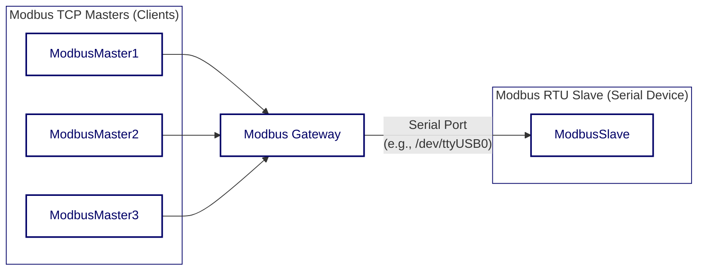

<div align="center">


  <a href="https://github.com/ffutop/modbus-gateway/releases">下载</a>
  ·
  <a href="https://github.com/ffutop/modbus-gateway/issues/new">提交问题</a>
  ·
  <a href="https://github.com/ffutop/modbus-gateway/issues/new">请求功能</a>

[English](README.md) |
[中文](README_CN.md)
</div>

# Modbus Gateway

一个使用 Go 语言编写的高性能、可配置的 Modbus TCP 到 Modbus RTU 网关。它充当一个桥梁，允许多个 Modbus TCP 主站（客户端）通过网络与单个 Modbus RTU 从站（串行设备）进行通信。

## 架构

网关接收来自多个 TCP 客户端的并发请求，将它们放入一个队列中，然后以串行方式逐一发送到 RTU 设备，确保了串行总线上的通信不会发生冲突。



## 主要特性

*   **协议转换**: 实现 Modbus TCP 到 Modbus RTU 的无缝转换。
*   **并发处理**: 支持多个 TCP 客户端同时连接，通过内部队列将并发请求串行化。
*   **灵活配置**: 支持通过命令行参数和 YAML 配置文件进行灵活配置。
*   **RS485 支持**: 内置对 RS485 通信模式的完整支持，包括 `RTS` 信号控制。
*   **健壮的日志系统**: 可配置的日志级别（debug, info, warn, error）和日志输出目标（文件或控制台）。
*   **连接管理**: 自动处理串口的连接、断开和空闲超时。

## 安装

确保您已安装 Go (版本 1.21+)。

```bash
# 克隆仓库
git clone https://github.com/ffutop/modbus-gateway.git
cd modbus-gateway

# 构建二进制文件
go build
```

执行完毕后，您将在项目根目录下找到名为 `modbus-gateway` 的可执行文件。

## 使用方法

您可以直接通过命令行参数启动网关。

### 命令行示例

连接到位于 `/dev/ttyUSB0` 的串口设备，波特率为 `9600`，并在本地 `5020` 端口上监听 TCP 连接：

```bash
./modbus-gateway -p /dev/ttyUSB0 -s 9600 -P 5020 -v debug
```

### 命令行参数

运行 `./modbus-gateway --help` 查看所有可用参数：

```text
Usage of ./modbus-gateway:
  -A, --tcp_address string   TCP server address to bind. (default "0.0.0.0")
  -C, --max_conns int        Maximum number of simultaneous TCP connections. (default 32)
  -L, --log_file string      Log file name ('-' for logging to STDOUT only).
  -P, --tcp_port int         TCP server port number. (default 502)
  -R, --rqst_pause int       Pause between requests in milliseconds. (default 100)
  -W, --timeout int          Response wait time in milliseconds. (default 500)
  -c, --config string        Configuration file path.
  -p, --device string        Serial port device name. (default "/tmp/pts1")
  -s, --baud_rate int        Serial port speed. (default 19200)
  -v, --log_level string     Log verbosity level (debug, info, warn, error). (default "info")
```

## 配置

网关的配置加载遵循以下优先级顺序： **命令行参数 > 配置文件 > 默认值**。

### 配置文件

您可以使用 YAML 文件来集中管理所有配置。通过 `-c` 或 `--config` 参数指定配置文件路径。

如果未指定配置文件路径，程序会依次在以下位置查找 `config.yaml`：
*   `/etc/modbusgw/`
*   `$HOME/.modbusgw/`
*   `./` (当前工作目录)

#### 示例 `config.yaml`

这是一个包含所有可配置项的示例文件。您可以根据需要进行删减。

```yaml
# TCP Server 配置
tcp_address: "0.0.0.0"
tcp_port: 502
max_conns: 32

# Serial/RTU 配置
device: "/dev/ttyUSB0" # 串口设备, e.g., "/dev/ttyUSB0" on Linux or "COM3" on Windows
baud_rate: 19200
data_bits: 8
parity: "N" # 校验位 (N: None, E: Even, O: Odd)
stop_bits: 1
timeout: 500ms      # RTU 响应超时, 支持单位: ns, us, ms, s, m, h
rqst_pause: 100ms   # 两个请求之间的间隔

# Serial/RTU RS485 配置 (仅在需要时配置)
rs485:
  enabled: true
  delay_rts_before_send: 2ms
  delay_rts_after_send: 2ms
  rts_high_during_send: true
  rts_high_after_send: false
  rx_during_tx: false

# 网关通用配置
log_level: "info" # 日志级别 (debug, info, warn, error)
log_file: ""      # 日志文件路径, 为空或'-'表示输出到控制台

```

## 开发与测试

本项目包含一套集成测试，用于验证网关的核心功能。

### 依赖

测试环境依赖 `socat` 来创建虚拟串口对。请确保您的系统已安装 `socat`。

在基于 Debian/Ubuntu 的系统上安装：
```bash
sudo apt-get update && sudo apt-get install -y socat
```

### 运行测试

测试脚本会自动处理虚拟串口的创建、启动模拟的 RTU 从站、运行网关以及执行测试用例。

```bash
cd test/
go test -v
```

## 许可证

本项目基于 BSD 许可证。详情请参阅[LICENSE 文件](LICENSE)。
