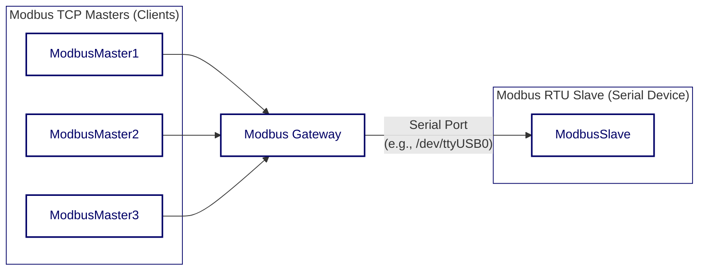

<div align="center">

<svg width="364.014" height="45.093" viewBox="0 0 364.014 45.093" xmlns="http://www.w3.org/2000/svg"><g id="svgGroup" stroke-linecap="round" fill-rule="evenodd" font-size="9pt" stroke="#000000" stroke-width="0.25mm" fill="#000000" style="stroke:#000000;stroke-width:0.25mm;fill:#000000"><path d="M 27.612 1.245 L 41.211 1.587 L 35.107 6.152 L 36.06 29.907 L 40.967 32.153 L 26.099 35.254 L 32.153 29.907 L 28.149 10.547 L 22.705 32.153 L 10.913 12.5 L 7.715 30.2 L 12.402 34.155 L 0 34.79 L 4.907 30.347 L 6.421 4.858 L 1.27 1.587 L 13.306 1.001 L 21.411 23.901 L 27.612 1.245 Z M 91.333 3.198 L 91.265 3.81 L 102.49 2.539 A 448.19 448.19 0 0 0 101.66 8.899 Q 101.318 11.694 101.099 13.892 Q 102.417 11.914 104.309 10.681 Q 106.201 9.448 108.643 9.448 A 10.148 10.148 0 0 1 111.792 9.888 A 7.304 7.304 0 0 1 114.099 11.096 Q 115.063 11.865 115.686 12.903 A 10.179 10.179 0 0 1 116.675 15.112 A 13.291 13.291 0 0 1 117.187 17.529 A 21.09 21.09 0 0 1 117.334 19.995 A 24.084 24.084 0 0 1 116.614 26.062 Q 115.894 28.833 114.49 30.835 Q 113.086 32.837 110.974 33.948 A 10.364 10.364 0 0 1 106.079 35.059 A 6.99 6.99 0 0 1 103.638 34.644 Q 102.515 34.229 101.636 33.521 A 7.736 7.736 0 0 1 100.11 31.873 A 8.207 8.207 0 0 1 99.097 29.858 L 96.631 35.547 L 95.679 6.396 L 91.173 4.637 L 88.184 31.445 L 93.579 33.447 L 84.741 35.156 L 84.839 30.396 A 14.51 14.51 0 0 1 83.496 32.312 A 10.006 10.006 0 0 1 81.799 33.936 A 8.206 8.206 0 0 1 79.712 35.071 A 7.082 7.082 0 0 1 77.222 35.498 Q 75.317 35.449 73.621 34.644 A 8.924 8.924 0 0 1 70.642 32.336 Q 69.36 30.835 68.616 28.65 A 15.447 15.447 0 0 1 67.871 23.657 A 20 20 0 0 1 68.677 17.676 Q 69.482 15.112 70.874 13.403 Q 72.266 11.694 74.133 10.84 Q 76.001 9.985 78.125 9.985 Q 80.273 9.985 82.117 10.901 A 8.445 8.445 0 0 1 85.132 13.354 L 85.229 7.593 L 79.272 5.347 L 91.333 3.198 Z M 301.489 10.303 L 312.5 10.498 L 308.838 13.501 L 307.153 31.104 L 310.547 33.35 L 299.951 34.595 L 302.246 32.007 L 296.851 22.095 L 292.896 31.958 L 295.288 34.058 L 285.449 35.059 L 288.892 31.909 L 284.644 14.209 L 280.298 12.402 L 293.652 9.692 L 290.698 13.086 L 291.748 28.345 L 298.193 12.646 L 303.247 27.344 L 306.396 12.891 L 301.489 10.303 Z M 197.778 20.093 L 213.086 18.237 L 209.082 22.241 L 208.228 35.645 L 206.03 31.494 A 12.841 12.841 0 0 1 201.819 34.424 Q 199.438 35.449 196.997 35.449 A 11.986 11.986 0 0 1 193.872 35.022 A 12.513 12.513 0 0 1 190.771 33.704 A 13.605 13.605 0 0 1 187.927 31.445 Q 186.597 30.078 185.608 28.21 A 18.467 18.467 0 0 1 184.033 23.95 A 22.508 22.508 0 0 1 183.447 18.604 A 21.276 21.276 0 0 1 184.253 12.451 Q 185.059 9.79 186.377 7.837 Q 187.695 5.884 189.355 4.59 A 16.984 16.984 0 0 1 192.725 2.515 Q 194.434 1.733 196.057 1.416 A 14.98 14.98 0 0 1 198.877 1.099 A 13.37 13.37 0 0 1 201.465 1.514 Q 202.563 1.807 203.857 2.441 A 9.071 9.071 0 0 1 206.274 4.199 L 211.841 0 L 204.541 13.159 L 204.541 6.299 A 6.341 6.341 0 0 0 202.698 5.029 A 10.935 10.935 0 0 0 200.854 4.382 A 8.522 8.522 0 0 0 199.377 4.138 A 20.552 20.552 0 0 0 198.633 4.102 A 6.634 6.634 0 0 0 195.239 5.225 Q 193.628 6.274 192.395 8.142 Q 191.162 10.01 190.43 12.61 A 21.367 21.367 0 0 0 189.697 18.408 A 21.332 21.332 0 0 0 190.43 24.219 A 14.396 14.396 0 0 0 192.444 28.625 Q 193.726 30.444 195.459 31.421 A 7.486 7.486 0 0 0 199.194 32.397 A 13.28 13.28 0 0 0 199.902 32.361 A 5.013 5.013 0 0 0 201.196 32.056 Q 201.953 31.787 202.832 31.189 A 8.292 8.292 0 0 0 204.59 29.492 L 203.735 23.193 L 197.778 20.093 Z M 364.014 10.693 L 360.327 13.159 A 68.317 68.317 0 0 1 360.706 17.505 A 61.247 61.247 0 0 1 360.804 21.008 A 65.988 65.988 0 0 1 360.791 22.314 Q 360.742 24.78 360.474 27.258 Q 360.205 29.736 359.619 32.019 A 24.135 24.135 0 0 1 358.105 36.279 A 13.203 13.203 0 0 1 355.823 39.709 Q 354.468 41.162 352.649 42.004 A 9.863 9.863 0 0 1 348.462 42.847 Q 345.776 42.847 342.725 41.504 L 340.918 45.093 L 338.428 35.498 Q 339.526 36.938 340.686 37.817 A 11.554 11.554 0 0 0 342.908 39.172 Q 343.97 39.648 344.861 39.795 A 9.343 9.343 0 0 0 346.313 39.941 Q 348.315 39.941 349.89 38.684 A 11.104 11.104 0 0 0 352.661 35.205 A 54.722 54.722 0 0 1 348.865 30.75 A 39.854 39.854 0 0 1 345.532 25.623 Q 344.043 22.9 343.03 19.897 A 27.095 27.095 0 0 1 341.724 13.647 L 337.72 11.499 L 349.023 9.888 L 346.924 12.744 A 42.149 42.149 0 0 0 349.365 22.388 A 62.27 62.27 0 0 0 354.077 32.007 Q 354.712 30.176 355.188 28.052 A 55.601 55.601 0 0 0 355.994 23.56 A 69.305 69.305 0 0 0 356.494 18.64 Q 356.665 16.089 356.714 13.452 L 353.076 9.888 A 566.703 566.703 0 0 1 356.653 10.156 A 647.974 647.974 0 0 0 359.351 10.364 Q 360.498 10.449 361.292 10.51 A 46.487 46.487 0 0 0 362.598 10.596 A 29.342 29.342 0 0 0 364.014 10.693 Z M 163.452 11.938 L 167.456 7.007 L 165.649 19.189 Q 165.356 17.92 164.624 16.687 Q 163.892 15.454 162.805 14.478 A 8.876 8.876 0 0 0 160.303 12.903 A 7.888 7.888 0 0 0 157.202 12.305 A 7.526 7.526 0 0 0 155.42 12.512 A 4.281 4.281 0 0 0 153.918 13.184 Q 153.271 13.647 152.893 14.355 A 3.526 3.526 0 0 0 152.515 16.04 A 2.77 2.77 0 0 0 153.162 17.944 A 5.225 5.225 0 0 0 154.858 19.177 Q 155.908 19.678 157.251 20.032 A 250.885 250.885 0 0 1 160.01 20.776 A 28.086 28.086 0 0 1 162.769 21.692 Q 164.111 22.217 165.161 23.047 A 6.362 6.362 0 0 1 166.858 25.11 A 6.484 6.484 0 0 1 167.505 28.149 A 7.016 7.016 0 0 1 166.711 31.604 Q 165.918 33.032 164.673 33.948 A 8.337 8.337 0 0 1 161.914 35.278 A 11.146 11.146 0 0 1 158.96 35.693 Q 157.788 35.693 156.616 35.449 A 13.533 13.533 0 0 1 154.346 34.766 A 13.536 13.536 0 0 1 152.258 33.716 Q 151.27 33.105 150.464 32.397 L 146.753 37.354 L 147.9 25.244 A 17.109 17.109 0 0 0 149.78 28.345 Q 150.879 29.785 152.222 30.847 A 11.13 11.13 0 0 0 155.103 32.507 A 8.748 8.748 0 0 0 158.301 33.105 Q 160.229 33.105 161.389 32.288 A 2.682 2.682 0 0 0 162.549 29.956 A 2.202 2.202 0 0 0 161.902 28.333 A 5.839 5.839 0 0 0 160.193 27.197 A 17.414 17.414 0 0 0 157.788 26.318 Q 156.445 25.928 155.029 25.464 Q 153.613 25 152.271 24.377 A 9.863 9.863 0 0 1 149.866 22.815 A 7.12 7.12 0 0 1 148.157 20.52 Q 147.51 19.165 147.51 17.236 A 7.736 7.736 0 0 1 147.998 14.355 A 6.477 6.477 0 0 1 149.28 12.292 A 6.851 6.851 0 0 1 151.062 10.925 Q 152.051 10.4 153.052 10.12 Q 154.053 9.839 154.956 9.741 Q 155.859 9.644 156.494 9.644 Q 157.422 9.644 158.374 9.802 A 12.282 12.282 0 0 1 160.242 10.266 A 11.785 11.785 0 0 1 161.975 10.999 Q 162.793 11.426 163.452 11.938 Z M 133.154 10.742 L 141.406 10.742 L 142.358 31.738 L 146.753 33.789 L 136.743 35.645 L 137.207 28.491 Q 136.523 29.932 135.645 31.238 Q 134.766 32.544 133.667 33.533 A 9.222 9.222 0 0 1 131.262 35.107 A 6.809 6.809 0 0 1 128.442 35.693 Q 126.636 35.693 125.269 35.059 Q 123.901 34.424 122.974 33.313 A 7.615 7.615 0 0 1 121.57 30.701 Q 121.094 29.199 121.094 27.49 A 23.312 23.312 0 0 1 121.338 24.194 A 31.845 31.845 0 0 1 122.009 20.813 A 30.159 30.159 0 0 1 123.035 17.566 A 26.2 26.2 0 0 1 124.341 14.648 L 119.189 13.452 L 128.857 10.156 Q 127.93 12.622 127.429 14.88 A 51.668 51.668 0 0 0 126.685 18.896 A 43.38 43.38 0 0 0 126.343 22.705 A 21.004 21.004 0 0 0 126.66 26.624 Q 126.978 28.271 127.539 29.358 Q 128.101 30.444 128.882 30.969 A 3.002 3.002 0 0 0 130.591 31.494 A 4.439 4.439 0 0 0 133.13 30.737 A 7.436 7.436 0 0 0 135.12 28.699 Q 135.986 27.417 136.609 25.708 Q 137.231 23.999 137.634 22.095 A 35.694 35.694 0 0 0 138.232 18.213 A 44.871 44.871 0 0 0 138.452 14.404 L 133.154 10.742 Z M 233.105 30.835 L 238.306 34.497 L 229.102 34.106 L 229.663 31.104 A 10.183 10.183 0 0 1 226.282 33.899 A 11.807 11.807 0 0 1 221.851 35.059 A 14.227 14.227 0 0 1 220.838 35.096 A 9.513 9.513 0 0 1 218.274 34.778 A 6.386 6.386 0 0 1 215.735 33.459 Q 214.722 32.568 214.233 31.262 A 8.28 8.28 0 0 1 213.745 28.345 Q 213.745 26.855 214.478 25.452 A 7.589 7.589 0 0 1 216.589 22.974 Q 217.969 21.899 219.971 21.252 Q 221.973 20.605 224.512 20.605 Q 225.684 20.605 227.209 20.825 A 9.053 9.053 0 0 1 230.103 21.753 Q 229.98 20.264 229.651 18.713 Q 229.321 17.163 228.687 15.894 A 5.951 5.951 0 0 0 227.039 13.831 Q 226.025 13.037 224.512 13.037 Q 223.218 13.037 221.997 13.574 Q 220.776 14.111 219.714 15.112 A 11.124 11.124 0 0 0 217.798 17.554 A 16.047 16.047 0 0 0 216.357 20.801 L 214.307 8.838 L 217.407 13.599 A 12.251 12.251 0 0 1 219.727 11.34 Q 220.898 10.498 222.058 10.046 A 9.81 9.81 0 0 1 224.304 9.448 A 15.632 15.632 0 0 1 226.392 9.302 Q 228.271 9.399 229.871 10.071 A 7.952 7.952 0 0 1 232.642 12 A 9.017 9.017 0 0 1 234.485 15.088 A 12.156 12.156 0 0 1 235.156 19.287 A 28.533 28.533 0 0 1 235.01 22.07 A 37.064 37.064 0 0 1 234.583 25.098 A 43.933 43.933 0 0 1 233.923 28.113 A 32.241 32.241 0 0 1 233.105 30.835 Z M 334.253 30.835 L 339.453 34.497 L 330.249 34.106 L 330.811 31.104 A 10.183 10.183 0 0 1 327.429 33.899 A 11.807 11.807 0 0 1 322.998 35.059 A 14.227 14.227 0 0 1 321.985 35.096 A 9.513 9.513 0 0 1 319.421 34.778 A 6.386 6.386 0 0 1 316.882 33.459 Q 315.869 32.568 315.381 31.262 A 8.28 8.28 0 0 1 314.893 28.345 Q 314.893 26.855 315.625 25.452 A 7.589 7.589 0 0 1 317.737 22.974 Q 319.116 21.899 321.118 21.252 Q 323.12 20.605 325.659 20.605 Q 326.831 20.605 328.357 20.825 A 9.053 9.053 0 0 1 331.25 21.753 Q 331.128 20.264 330.798 18.713 Q 330.469 17.163 329.834 15.894 A 5.951 5.951 0 0 0 328.186 13.831 Q 327.173 13.037 325.659 13.037 Q 324.365 13.037 323.145 13.574 Q 321.924 14.111 320.862 15.112 A 11.124 11.124 0 0 0 318.945 17.554 A 16.047 16.047 0 0 0 317.505 20.801 L 315.454 8.838 L 318.555 13.599 A 12.251 12.251 0 0 1 320.874 11.34 Q 322.046 10.498 323.206 10.046 A 9.81 9.81 0 0 1 325.452 9.448 A 15.632 15.632 0 0 1 327.539 9.302 Q 329.419 9.399 331.018 10.071 A 7.952 7.952 0 0 1 333.789 12 A 9.017 9.017 0 0 1 335.632 15.088 A 12.156 12.156 0 0 1 336.304 19.287 A 28.533 28.533 0 0 1 336.157 22.07 A 37.064 37.064 0 0 1 335.73 25.098 A 43.933 43.933 0 0 1 335.071 28.113 A 32.241 32.241 0 0 1 334.253 30.835 Z M 242.529 15.039 L 238.306 15.308 L 250.22 2.295 A 126.819 126.819 0 0 0 247.925 10.352 L 257.422 11.157 L 256.177 14.087 L 246.973 14.746 Q 246.631 16.528 246.448 17.908 Q 246.265 19.287 246.143 20.239 A 40.296 40.296 0 0 0 245.972 22.192 A 29.818 29.818 0 0 0 246.265 26.587 A 12.713 12.713 0 0 0 247.18 29.919 A 5.441 5.441 0 0 0 248.767 32.043 A 3.663 3.663 0 0 0 251.074 32.788 A 4.025 4.025 0 0 0 253.162 32.288 Q 254.004 31.787 254.517 30.994 A 5.419 5.419 0 0 0 255.249 29.211 Q 255.469 28.223 255.469 27.246 A 10.387 10.387 0 0 0 255.322 25.488 A 3.518 3.518 0 0 1 256.921 27.209 A 6.045 6.045 0 0 1 257.471 29.785 Q 257.471 31.226 256.995 32.324 A 5.231 5.231 0 0 1 255.688 34.167 Q 254.858 34.912 253.735 35.303 Q 252.612 35.693 251.318 35.693 Q 250.537 35.693 249.475 35.522 Q 248.413 35.352 247.266 34.9 Q 246.118 34.448 244.995 33.618 A 8.485 8.485 0 0 1 242.993 31.47 Q 242.114 30.151 241.565 28.259 A 16.071 16.071 0 0 1 241.016 23.804 Q 241.016 21.509 241.492 19.226 A 53.417 53.417 0 0 1 242.529 15.039 Z M 280.566 21.24 L 264.722 25.537 A 17.312 17.312 0 0 0 265.576 28.21 Q 266.113 29.517 266.895 30.542 Q 267.676 31.567 268.701 32.202 Q 269.727 32.837 271.021 32.837 Q 272.729 32.837 273.999 32.129 Q 275.269 31.421 276.074 30.334 A 6.591 6.591 0 0 0 277.197 27.942 A 6.659 6.659 0 0 0 277.394 26.367 A 5.746 5.746 0 0 0 277.319 25.439 A 3.371 3.371 0 0 1 278.455 26.147 A 3.465 3.465 0 0 1 279.163 27.112 A 4.058 4.058 0 0 1 279.517 28.186 Q 279.614 28.735 279.614 29.248 A 4.182 4.182 0 0 1 278.931 31.506 A 6.641 6.641 0 0 1 277.014 33.435 A 10.619 10.619 0 0 1 274.097 34.79 A 12.615 12.615 0 0 1 270.41 35.303 A 10.634 10.634 0 0 1 265.613 34.253 A 10.718 10.718 0 0 1 262.036 31.409 Q 260.571 29.614 259.79 27.197 A 16.65 16.65 0 0 1 259.009 22.046 Q 259.009 19.263 259.79 16.907 Q 260.571 14.551 262.097 12.891 Q 263.623 11.23 265.845 10.376 A 11.565 11.565 0 0 1 270.022 9.664 A 16.17 16.17 0 0 1 270.972 9.692 A 8.302 8.302 0 0 1 274.658 10.84 Q 276.343 11.841 277.6 13.416 Q 278.857 14.99 279.626 17.017 Q 280.396 19.043 280.566 21.24 Z M 42.688 17.175 A 14.428 14.428 0 0 0 41.821 22.241 A 14.538 14.538 0 0 0 42.798 27.747 A 12.206 12.206 0 0 0 45.422 31.812 Q 47.07 33.472 49.231 34.338 Q 51.392 35.205 53.784 35.205 Q 56.274 35.205 58.411 34.277 A 10.594 10.594 0 0 0 62.085 31.653 A 11.251 11.251 0 0 0 64.417 27.527 A 14.059 14.059 0 0 0 65.069 23.141 A 18.416 18.416 0 0 0 65.039 22.095 A 16.879 16.879 0 0 0 63.965 16.968 Q 63.062 14.648 61.548 12.988 Q 60.034 11.328 57.983 10.413 Q 55.933 9.497 53.467 9.497 Q 50.928 9.497 48.792 10.461 A 11.069 11.069 0 0 0 45.105 13.135 A 12.339 12.339 0 0 0 42.688 17.175 Z M 47.827 22.656 A 11.633 11.633 0 0 0 48.437 26.538 A 9.234 9.234 0 0 0 50.073 29.48 A 7.321 7.321 0 0 0 52.441 31.348 A 6.345 6.345 0 0 0 55.273 32.007 Q 56.763 32.007 58.057 31.36 A 6.719 6.719 0 0 0 60.303 29.529 A 8.82 8.82 0 0 0 61.792 26.685 Q 62.329 25.024 62.329 22.998 Q 62.329 20.996 61.792 19.226 Q 61.255 17.456 60.291 16.138 A 7.36 7.36 0 0 0 58.008 14.062 Q 56.689 13.306 55.127 13.306 Q 53.735 13.306 52.429 13.94 A 7.151 7.151 0 0 0 50.098 15.784 Q 49.072 16.992 48.45 18.726 Q 47.827 20.459 47.827 22.656 Z M 84.937 25.708 L 85.083 17.749 Q 84.717 16.87 84.167 16.064 A 8.359 8.359 0 0 0 82.947 14.636 A 5.697 5.697 0 0 0 81.458 13.635 A 4.051 4.051 0 0 0 79.736 13.257 Q 78.052 13.257 76.868 14.087 A 6.325 6.325 0 0 0 74.915 16.382 A 11.887 11.887 0 0 0 73.792 19.849 A 24.991 24.991 0 0 0 73.437 24.194 A 16.892 16.892 0 0 0 73.73 27.429 Q 74.023 28.931 74.585 30.029 Q 75.146 31.128 76.001 31.763 Q 76.855 32.397 77.979 32.397 A 7.242 7.242 0 0 0 78.467 32.349 A 5.193 5.193 0 0 0 79.492 32.092 A 8.366 8.366 0 0 0 80.847 31.47 Q 81.592 31.055 82.336 30.31 A 9.934 9.934 0 0 0 83.765 28.442 Q 84.448 27.319 84.937 25.708 Z M 106.445 13.208 Q 105.42 13.208 104.517 13.721 Q 103.613 14.233 102.869 15.112 A 9.985 9.985 0 0 0 101.55 17.151 A 15.855 15.855 0 0 0 100.586 19.604 A 61.572 61.572 0 0 0 100.513 20.813 A 17.767 17.767 0 0 0 100.488 21.655 Q 100.464 22.07 100.488 22.339 Q 100.488 25.171 100.903 27.026 Q 101.318 28.882 102.026 29.993 Q 102.734 31.104 103.674 31.555 Q 104.614 32.007 105.64 32.007 A 3.581 3.581 0 0 0 107.739 31.226 Q 108.813 30.444 109.705 28.979 A 13.955 13.955 0 0 0 111.169 25.439 A 17.605 17.605 0 0 0 111.743 20.752 A 10.96 10.96 0 0 0 111.304 17.505 Q 110.864 16.089 110.12 15.137 A 5.132 5.132 0 0 0 108.423 13.696 A 4.281 4.281 0 0 0 106.445 13.208 Z M 264.307 22.949 L 275.024 19.043 A 16.943 16.943 0 0 0 273.816 16.028 A 10.214 10.214 0 0 0 272.412 13.965 Q 271.68 13.159 270.935 12.781 A 3.152 3.152 0 0 0 269.507 12.402 Q 268.481 12.402 267.7 12.793 A 4.29 4.29 0 0 0 266.345 13.855 A 6.446 6.446 0 0 0 265.369 15.43 Q 264.966 16.333 264.722 17.358 A 16.102 16.102 0 0 0 264.368 19.47 Q 264.258 20.557 264.258 21.606 L 264.258 22.278 A 4.744 4.744 0 0 0 264.307 22.949 Z M 230.2 24.536 L 230.2 24.243 Q 229.321 23.901 228.43 23.718 A 18.611 18.611 0 0 0 226.782 23.45 Q 226.025 23.364 225.5 23.352 Q 224.976 23.34 224.805 23.34 A 6.374 6.374 0 0 0 222.388 23.853 A 5.439 5.439 0 0 0 220.691 25.012 A 4.608 4.608 0 0 0 219.69 26.563 Q 219.36 27.417 219.36 28.247 Q 219.36 30.127 220.276 31.091 A 3.514 3.514 0 0 0 222.949 32.056 Q 224.121 32.056 225.171 31.641 Q 226.221 31.226 227.136 30.53 Q 228.052 29.834 228.796 28.943 A 13.838 13.838 0 0 0 230.103 27.1 Q 230.151 26.416 230.176 25.781 A 32.404 32.404 0 0 0 230.2 24.536 Z M 331.348 24.536 L 331.348 24.243 Q 330.469 23.901 329.578 23.718 A 18.611 18.611 0 0 0 327.93 23.45 Q 327.173 23.364 326.648 23.352 Q 326.123 23.34 325.952 23.34 A 6.374 6.374 0 0 0 323.535 23.853 A 5.439 5.439 0 0 0 321.838 25.012 A 4.608 4.608 0 0 0 320.837 26.563 Q 320.508 27.417 320.508 28.247 Q 320.508 30.127 321.423 31.091 A 3.514 3.514 0 0 0 324.097 32.056 Q 325.269 32.056 326.318 31.641 Q 327.368 31.226 328.284 30.53 Q 329.199 29.834 329.944 28.943 A 13.838 13.838 0 0 0 331.25 27.1 Q 331.299 26.416 331.323 25.781 A 32.404 32.404 0 0 0 331.348 24.536 Z"/></g></svg>

  <a href="https://github.com/ffutop/modbus-gateway/releases">下载</a>
  ·
  <a href="https://github.com/ffutop/modbus-gateway/issues/new">提交问题</a>
  ·
  <a href="https://github.com/ffutop/modbus-gateway/issues/new">请求功能</a>

[English](README.md) |
[中文](README_CN.md)
</div>

# Modbus Gateway

一个使用 Go 语言编写的高性能、可配置的 Modbus TCP 到 Modbus RTU 网关。它充当一个桥梁，允许多个 Modbus TCP 主站（客户端）通过网络与单个 Modbus RTU 从站（串行设备）进行通信。

## 架构

网关接收来自多个 TCP 客户端的并发请求，将它们放入一个队列中，然后以串行方式逐一发送到 RTU 设备，确保了串行总线上的通信不会发生冲突。



## 主要特性

*   **协议转换**: 实现 Modbus TCP 到 Modbus RTU 的无缝转换。
*   **并发处理**: 支持多个 TCP 客户端同时连接，通过内部队列将并发请求串行化。
*   **灵活配置**: 支持通过命令行参数和 YAML 配置文件进行灵活配置。
*   **RS485 支持**: 内置对 RS485 通信模式的完整支持，包括 `RTS` 信号控制。
*   **健壮的日志系统**: 可配置的日志级别（debug, info, warn, error）和日志输出目标（文件或控制台）。
*   **连接管理**: 自动处理串口的连接、断开和空闲超时。

## 安装

确保您已安装 Go (版本 1.21+)。

```bash
# 克隆仓库
git clone https://github.com/ffutop/modbus-gateway.git
cd modbus-gateway

# 构建二进制文件
go build
```

执行完毕后，您将在项目根目录下找到名为 `modbus-gateway` 的可执行文件。

## 使用方法

您可以直接通过命令行参数启动网关。

### 命令行示例

连接到位于 `/dev/ttyUSB0` 的串口设备，波特率为 `9600`，并在本地 `5020` 端口上监听 TCP 连接：

```bash
./modbus-gateway -p /dev/ttyUSB0 -s 9600 -P 5020 -v debug
```

### 命令行参数

运行 `./modbus-gateway --help` 查看所有可用参数：

```text
Usage of ./modbus-gateway:
  -A, --tcp_address string   TCP server address to bind. (default "0.0.0.0")
  -C, --max_conns int        Maximum number of simultaneous TCP connections. (default 32)
  -L, --log_file string      Log file name ('-' for logging to STDOUT only).
  -P, --tcp_port int         TCP server port number. (default 502)
  -R, --rqst_pause int       Pause between requests in milliseconds. (default 100)
  -W, --timeout int          Response wait time in milliseconds. (default 500)
  -c, --config string        Configuration file path.
  -p, --device string        Serial port device name. (default "/tmp/pts1")
  -s, --baud_rate int        Serial port speed. (default 19200)
  -v, --log_level string     Log verbosity level (debug, info, warn, error). (default "info")
```

## 配置

网关的配置加载遵循以下优先级顺序： **命令行参数 > 配置文件 > 默认值**。

### 配置文件

您可以使用 YAML 文件来集中管理所有配置。通过 `-c` 或 `--config` 参数指定配置文件路径。

如果未指定配置文件路径，程序会依次在以下位置查找 `config.yaml`：
*   `/etc/modbusgw/`
*   `$HOME/.modbusgw/`
*   `./` (当前工作目录)

#### 示例 `config.yaml`

这是一个包含所有可配置项的示例文件。您可以根据需要进行删减。

```yaml
# TCP Server 配置
tcp_address: "0.0.0.0"
tcp_port: 502
max_conns: 32

# Serial/RTU 配置
device: "/dev/ttyUSB0" # 串口设备, e.g., "/dev/ttyUSB0" on Linux or "COM3" on Windows
baud_rate: 19200
data_bits: 8
parity: "N" # 校验位 (N: None, E: Even, O: Odd)
stop_bits: 1
timeout: 500ms      # RTU 响应超时, 支持单位: ns, us, ms, s, m, h
rqst_pause: 100ms   # 两个请求之间的间隔

# Serial/RTU RS485 配置 (仅在需要时配置)
rs485:
  enabled: true
  delay_rts_before_send: 2ms
  delay_rts_after_send: 2ms
  rts_high_during_send: true
  rts_high_after_send: false
  rx_during_tx: false

# 网关通用配置
log_level: "info" # 日志级别 (debug, info, warn, error)
log_file: ""      # 日志文件路径, 为空或'-'表示输出到控制台

```

## 开发与测试

本项目包含一套集成测试，用于验证网关的核心功能。

### 依赖

测试环境依赖 `socat` 来创建虚拟串口对。请确保您的系统已安装 `socat`。

在基于 Debian/Ubuntu 的系统上安装：
```bash
sudo apt-get update && sudo apt-get install -y socat
```

### 运行测试

测试脚本会自动处理虚拟串口的创建、启动模拟的 RTU 从站、运行网关以及执行测试用例。

```bash
cd test/
go test -v
```

## 许可证

本项目基于 BSD 许可证。详情请参阅[LICENSE 文件](LICENSE)。
