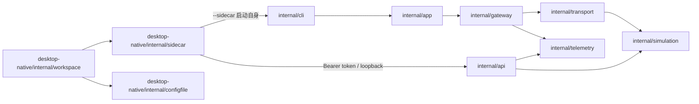

# ModMux 原生桌面管理 — 最终架构基线

基线版本：v0.6.1。本文记录规整分支保留的需求与架构；详细功能见 [桌面使用说明](../../../desktop-native/README.md)，设计决策和验证入口见 [架构与验证](../../../desktop-native/DEVELOPMENT.md)。

## 目标与约束

现场工程师需要查看转发状态、请求和寄存器，并在应用配置前发现路由、引用和映射错误。产品提供 CLI 网关及 Gio 原生桌面应用；根网关可独立无头部署，桌面框架依赖留在独立模块内。三个 Go 模块统一最低 Go 1.24.3。

`config.yaml` 是权威产物。v0 保持兼容，v1 拒绝未知字段；桌面编辑必须保留未展示字段和注释，检测外部修改，并区分草稿、已保存配置和运行配置。服务端默认不开启管理监听，现有 CLI 的路由、启动和关闭语义保留。

## 最终模块关系

协议及传输实现位于 `internal/`。共享 Simulation 拥有模型和持久化生命周期，local 和 injector 下游将 Modbus 请求转换为模型读写。UI 使用后台缓存数据，子进程协议转发不受界面渲染运行时直接影响。

## 子进程与只读管理接口

桌面同一可执行文件通过 `--sidecar` 调用根模块 `internal/cli`，参数包括 `-ui-listen 127.0.0.1:0`、`-exit-on-stdin-eof` 和结构化 stderr 日志。子进程通过 stdout 的 `ui_ready` 通知实际管理地址，每次启动使用独立 `MODMUX_UI_TOKEN`。父进程关闭 stdin 后子进程优雅停止，刷新持久化；父进程输出管道关闭不能通过 SIGPIPE 中断该过程。

管理接口保留 `/api/v1/status`、`/api/v1/events` 和 `/api/v1/simulations/{name}/registers`。状态报告上游监听进度；事件携带请求及响应 PDU。接口执行 token 和 loopback Host 检查，返回安全响应头；事件流在关闭时及时终止。配置由桌面本地文件模块修改。

## 配置工作台与监控

配置工作台支持 v1 结构编辑、共享模型引用迁移、批量事务、撤销重做、原文编辑、保存冲突处理和草稿恢复。保存并应用须确认重启；全部监听器成功后提交运行基线。失败时保留草稿和最近健康快照，恢复不覆盖磁盘配置。

监控按链路和 Slave ID 显示拓扑、请求时序与寄存器。进程内调用不伪造线路帧；设备值来自成功读取，模拟值来自运行模型。缺失、未采集、异常与缓冲区淘汰明确表达。运行日志独立于管理连接缓存，支持筛选、暂停、复制和导出。

设计令牌唯一来源为 `desktop-native/design/tokens.json`，通过生成器同步界面。字体、图标和许可随应用打包，离线运行不依赖 CDN。发布支持 macOS、Windows、Linux 的 amd64 和 arm64。

## 验收原则

分别验证根模块、桌面模块和端到端模块；检查 v0/v1 配置兼容、CLI 默认行为、子进程生命周期、PDU 与寄存器读取、失败配置应用和持久化刷新。打包脚本、CI 和双语用户文档对应最终实现。平台交叉编译与离屏布局测试不能代替各操作系统实机交互验收。
